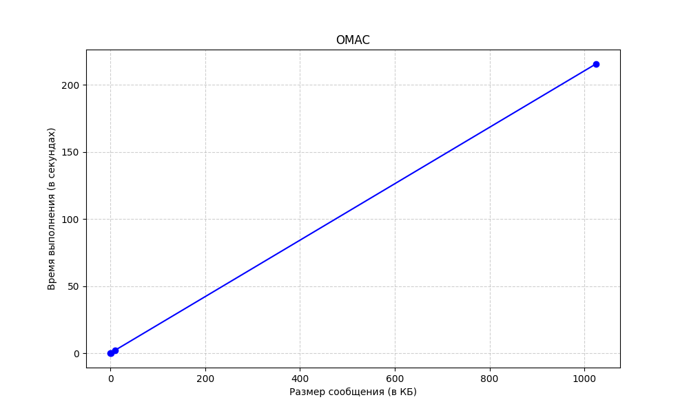

# Лабораторная работа №3 (МСКЗИ)
- В папке `mymacs` находятся реализации `OMAC`, `TMAC`, `HMAC`.
- В `mylibs/mac.py` находится их прототип, класс `VirtualMac`.
- `tests.py` содержит проверку `OMAC`, `TMAC`, `HMAC` для сообщений длиной 1 и 2.5 блока.
- `graphs.py` содержит функции для построения графиков времени выполнения `OMAC` и `HMAC`.

Время выполнения для разных MAC (на 1000 итераций):

Полулогарифмические графики (по OX - log масштаб):

Линейные графики:

