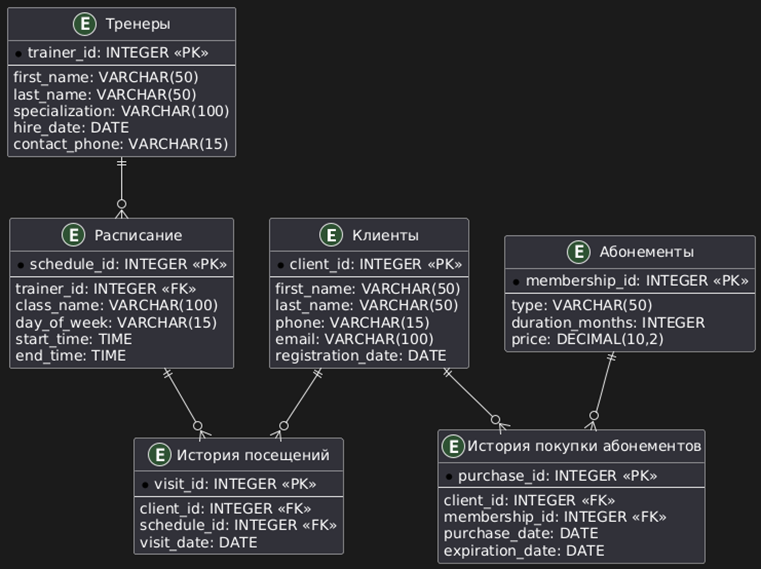

> Схема базы данных фитнес-центра:
>
> 

----

#### На защиту:

> 1. Что делает модуль `faker`?

Библиотека `faker` используется для автоматической генерации реалистичных тестовых данных при заполнении базы данных фитнес-центра. Она позволяет создавать:

- Персональные данные, такие как имена, фамилии, уникальные номера телефонов и email-адреса клиентов и тренеров – `first_name()`, `last_name()`, `phone_number()`, `email()`.
- Даты и время, например даты регистрации, найма, покупки абонементов, а также расписание занятий – `date_between()`, `time()`.
- Случайные выборки для специализации тренеров, типов абонементов, дней недели для занятий – `random.choice()` в связке с заданными списками данных.

Методы `unique.phone_number()` и `unique.email()` гарантируют отсутствие дубликатов среди данных.

> 2. Выведите рейтинг покупаемости абонементов за текущий год.
>    (1) id абонемента
>    (2) место в рейтинге по количеству покупок за последний год
>    (3) на сколько позиций изменилось это место по сравнению с таким же рейтингом прошлого года

SQL-запрос:

```sqlite
WITH current_year AS (
    SELECT 
        membership_id,
        COUNT(*) AS current_purchases,
        RANK() OVER (ORDER BY COUNT(*) DESC) AS current_rank
    FROM purchases
    WHERE purchase_date >= DATE('now', '-1 year')
    GROUP BY membership_id
),
previous_year AS (
    SELECT 
        membership_id,
        COUNT(*) AS previous_purchases,
        RANK() OVER (ORDER BY COUNT(*) DESC) AS previous_rank
    FROM purchases
    WHERE purchase_date BETWEEN DATE('now', '-2 years') AND DATE('now', '-1 year')
    GROUP BY membership_id
)
SELECT 
    cy.membership_id,
    cy.current_rank,
    (py.previous_rank - cy.current_rank) AS rank_change
FROM current_year cy
LEFT JOIN previous_year py ON cy.membership_id = py.membership_id
ORDER BY cy.current_rank;
```

Для каждого `membership_id` подсчитывается количество покупок за последний год, затем присваивается `current_rank` с помощью функции `RANK()`, которая сортирует абонементы по убыванию количества покупок.

Аналогично подсчитывается количество покупок и `previous_rank` для покупок, которым более года. Данные текущего и прошлого года объединяются по `membership_id` с помощью `LEFT JOIN`. Если абонемент существует только в текущем году (либо его не покупали в прошлом), то для него значение `previous_rank` будет `NULL` (для текущих данных такой ситуации не возникло).

Итоговый результат включает три поля:

- `membership_id` — идентификатор абонемента.
- `current_rank` — текущее место в рейтинге.
- `rank_change` — изменение позиции относительно прошлого года (положительное значение — улучшение, отрицательное — ухудшение).

Итоговый рейтинг сортируется по `current_rank`. Если два абонемента имеют одинаковое количество покупок, они получат одинаковый ранг.

Вывод для текущего заполнения базы данных:

```json
[{'membership_id': 7, 'current_rank': 1, 'rank_change': 3},
{'membership_id': 8, 'current_rank': 2, 'rank_change': 2},
{'membership_id': 5, 'current_rank': 2, 'rank_change': 5},
{'membership_id': 6, 'current_rank': 4, 'rank_change': 2},
{'membership_id': 4, 'current_rank': 5, 'rank_change': -2},
{'membership_id': 3, 'current_rank': 6, 'rank_change': 2},
{'membership_id': 2, 'current_rank': 6, 'rank_change': -5},
{'membership_id': 1, 'current_rank': 8, 'rank_change': -6}]
```