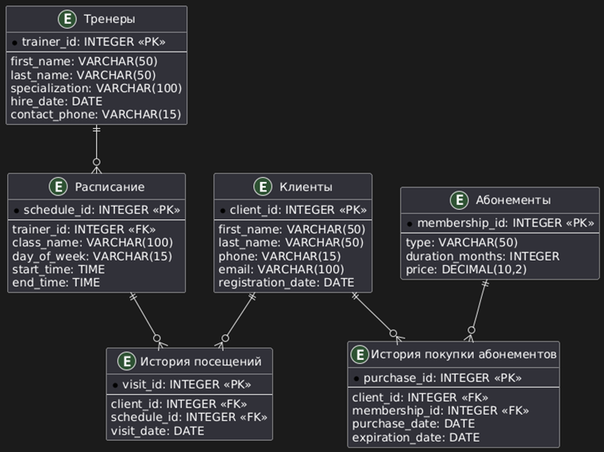

> Схема базы данных фитнес-центра:
>
> 

----

#### На защиту:

> Для каждого тренера выведите имя самого преданного клиента и кол-во посещений им его занятий

SQL-запрос:

```postgresql
WITH TrainerClientVisits AS (
    SELECT 
        t.trainer_id,
        t.first_name || ' ' || t.last_name AS trainer_name,
        c.client_id,
        c.first_name || ' ' || c.last_name AS client_name,
        COUNT(v.visit_id) AS visit_count
    FROM trainers t
    JOIN schedule s ON t.trainer_id = s.trainer_id
    JOIN visits v ON s.schedule_id = v.schedule_id
    JOIN clients c ON v.client_id = c.client_id
    GROUP BY t.trainer_id, c.client_id
),
RankedClients AS (
    SELECT 
        trainer_name,
        client_name,
        visit_count,
        RANK() OVER (PARTITION BY trainer_id ORDER BY visit_count DESC) AS rank
    FROM TrainerClientVisits
)
SELECT 
    trainer_name,
    client_name,
    visit_count
FROM RankedClients
WHERE rank = 1
ORDER BY trainer_name;
```

Данный запрос связывает таблицы `trainers`, `schedule`, и `visits` через соответствующие ключи, затем для каждого тренера находит клиентов, которые посещали его занятия. Подсчитывается количество посещений для каждого клиента и выбирается клиент с максимальным количеством посещений с помощью оконной функции `RANK()`. `PARTITION BY trainer_id` разделяет данные по тренерам. Если таких клиентов несколько, они все попадают в выдачу.

Результат запроса:

```json
[{'trainer_name': 'Адриан Гущин', 'client_name': 'Кира Игнатьев', 'visit_count': 1}, {'trainer_name': 'Адриан Гущин', 'client_name': 'Ирина Симонов', 'visit_count': 1}, {'trainer_name': 'Адриан Гущин', 'client_name': 'Никон Пахомов', 'visit_count': 1}, {'trainer_name': 'Адриан Гущин', 'client_name': 'Михей Мухин', 'visit_count': 1}, {'trainer_name': 'Адриан Гущин', 'client_name': 'Александра Якушева', 'visit_count': 1}, {'trainer_name': 'Адриан Гущин', 'client_name': 'Святополк Кудрявцева', 'visit_count': 1}, {'trainer_name': 'Адриан Гущин', 'client_name': 'Марк Юдин', 'visit_count': 1}, {'trainer_name': 'Адриан Гущин', 'client_name': 'Адриан Савина', 'visit_count': 1}, {'trainer_name': 'Адриан Гущин', 'client_name': 'Лора Ермаков', 'visit_count': 1}, {'trainer_name': 'Адриан Гущин', 'client_name': 'Мир Родионова', 'visit_count': 1}, {'trainer_name': 'Адриан Гущин', 'client_name': 'Евстафий Соболев', 'visit_count': 1}, {'trainer_name': 'Адриан Гущин', 'client_name': 'Твердислав Власов', 'visit_count': 1}, {'trainer_name': 'Адриан Гущин', 'client_name': 'Демид Михеева', 'visit_count': 1}, {'trainer_name': 'Адриан Гущин', 'client_name': 'Селиван Миронов', 'visit_count': 1}, {'trainer_name': 'Адриан Гущин', 'client_name': 'Феликс Бирюков', 'visit_count': 1}, {'trainer_name': 'Адриан Гущин', 'client_name': 'Галина Александров', 'visit_count': 1}, {'trainer_name': 'Александр Большаков', 'client_name': 'Никифор Блохина', 'visit_count': 1}, {'trainer_name': 'Александр Большаков', 'client_name': 'Екатерина Козлов', 'visit_count': 1}, {'trainer_name': 'Александр Большаков', 'client_name': 'Святополк Кудрявцева', 'visit_count': 1}, {'trainer_name': 'Александр Большаков', 'client_name': 'Стоян Егорова', 'visit_count': 1}, {'trainer_name': 'Александр Большаков', 'client_name': 'Светлана Моисеева', 'visit_count': 1}, {'trainer_name': 'Александр Большаков', 'client_name': 'Милен Шестаков', 'visit_count': 1}, {'trainer_name': 'Александр Большаков', 'client_name': 'Капитон Сысоева', 'visit_count': 1}, {'trainer_name': 'Ангелина Крюкова', 'client_name': 'Мстислав Рогов', 'visit_count': 2}, {'trainer_name': 'Ангелина Крюкова', 'client_name': 'Эрнст Блинов', 'visit_count': 2}, {'trainer_name': 'Ангелина Крюкова', 'client_name': 'Кира Андреев', 'visit_count': 2}, {'trainer_name': 'Ангелина Крюкова', 'client_name': 'Селиверст Никитин', 'visit_count': 2}, {'trainer_name': 'Ангелина Крюкова', 'client_name': 'Раиса Суворова', 'visit_count': 2}, {'trainer_name': 'Иннокентий Голубева', 'client_name': 'Платон Куликов', 'visit_count': 1}, {'trainer_name': 'Иннокентий Голубева', 'client_name': 'Федор Калашников', 'visit_count': 1}, {'trainer_name': 'Иннокентий Голубева', 'client_name': 'Фома Яковлева', 'visit_count': 1}, {'trainer_name': 'Иннокентий Голубева', 'client_name': 'Агафон Ефремова', 'visit_count': 1}, {'trainer_name': 'Иннокентий Голубева', 'client_name': 'Изот Лапина', 'visit_count': 1}, {'trainer_name': 'Ираида Жуков', 'client_name': 'Автоном Коновалов', 'visit_count': 3}, {'trainer_name': 'Ольга Носов', 'client_name': 'Милен Шестаков', 'visit_count': 2}, {'trainer_name': 'Петр Воронов', 'client_name': 'Марк Гурьев', 'visit_count': 1}, {'trainer_name': 'Петр Воронов', 'client_name': 'Александра Якушева', 'visit_count': 1}, {'trainer_name': 'Петр Воронов', 'client_name': 'Феофан Панов', 'visit_count': 1}, {'trainer_name': 'Петр Воронов', 'client_name': 'Наталья Соколов', 'visit_count': 1}, {'trainer_name': 'Петр Воронов', 'client_name': 'Андроник Гусев', 'visit_count': 1}, {'trainer_name': 'Петр Воронов', 'client_name': 'Велимир Горшкова', 'visit_count': 1}, {'trainer_name': 'Петр Воронов', 'client_name': 'Егор Кулаков', 'visit_count': 1}, {'trainer_name': 'Петр Воронов', 'client_name': 'Доброслав Зыкова', 'visit_count': 1}, {'trainer_name': 'Петр Воронов', 'client_name': 'Назар Фролова', 'visit_count': 1}, {'trainer_name': 'Петр Воронов', 'client_name': 'Никифор Блохина', 'visit_count': 1}, {'trainer_name': 'Петр Воронов', 'client_name': 'Афанасий Носков', 'visit_count': 1}, {'trainer_name': 'Петр Воронов', 'client_name': 'Прокл Хохлов', 'visit_count': 1}, {'trainer_name': 'Татьяна Никифоров', 'client_name': 'Марк Гурьев', 'visit_count': 3}, {'trainer_name': 'Ульян Трофимов', 'client_name': 'Феофан Панов', 'visit_count': 2}, {'trainer_name': 'Ульян Трофимов', 'client_name': 'Алина Маслов', 'visit_count': 2}, {'trainer_name': 'Фома Родионов', 'client_name': 'Венедикт Воронцова', 'visit_count': 3}]
```
