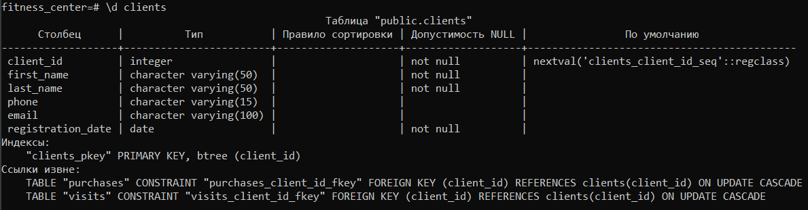

##### Национальный исследовательский ядерный университет «МИФИ» (Московский Инженерно-Физический Институт)
##### Кафедра №42 «Криптология и кибербезопасность»

---

### Лабораторная работа №1-4: «PostgreSQL»

##### Антон Гатченко Б22-525

##### 2025 г.

---

#### Используемая рабочая среда:
- Процессор - AMD Ryzen 5 5600H (laptop), 6c/12t
- Оперативная память – DDR4 16 ГБ
- ОС - Windows 10 Pro 22H2 19045.5608, 64 bit
- PostgreSQL 17.4, psql

---

#### Установка PostgreSQL:

В ходе лабораторной работы была произведена установка `PostgreSQL` версии 17.4 с клиентом `psql`. Для входа в терминал использовалась команда `psql -U postgres`.

Используемые команды после входа в `psql`:

- `\l` — показать список БД;
- `\c имя_бд` — подключиться к БД;
- `\dt` — показать таблицы;
- `\d имя_таблицы` — посмотреть структуру таблицы;
- `\q` — выйти из psql.

#### Создание БД:

В файле `create.sql`, используемом для создания таблиц в БД, необходимо было изменить `AUTOINCREMENT` на `SERIAL`. Остальные команды не менялись. Исходный код файла можно найти в [Приложении 5](#Приложение-5).

```postgresql
CREATE TABLE clients (
    client_id SERIAL PRIMARY KEY,
    ...
)
```

Для запуска скрипта создания таблиц использовалась команда `psql -U postgres -d fitness_center -f create.sql`. Вывод списка баз данных после создания:

| Имя            | Владелец | Кодировка | Провайдер локали | LC_COLLATE | LC_CTYPE | Локаль | Правила ICU | Права доступа |
| -------------- | -------- | --------- | ---------------- | ---------- | -------- | ------ | ----------- | ------------- |
| fitness_center | postgres | UTF8      | libc             | ru-RU      | ru-RU    |        |             |               |

Вывод команды `\dt` (список отношений):

| Схема  | Имя         | Тип     | Владелец |
| ------ | ----------- | ------- | -------- |
| public | clients     | таблица | postgres |
| public | memberships | таблица | postgres |
| public | purchases   | таблица | postgres |
| public | schedule    | таблица | postgres |
| public | trainers    | таблица | postgres |
| public | visits      | таблица | postgres |

Вывод структуры таблицы `clients`:



#### Заполнение БД данными:

Для подключения к БД посредством библиотек `Python` вместо простого пути, как было в `SQLite`, используется словарь:

```json
{
	"dbname": "fitness_center",
	"user": "postgres",
	"password": "<password>",
	"host": "localhost",
	"port": 5432
}
```

Параметры передаются через `%s` вместо `?`.

#### Запросы к БД:

Полный листинг запросов находится в [Приложении 1](#Приложение-1). Для каждой пары приведенных запросов верхний запрос - `PostgreSQL`, нижний - `SQLite3`.

Основные отличия между запросами заключаются в написании дат:

`PostgreSQL`: `CURRENT_DATE`, `INTERVAL '30 days'`, `DATE_TRUNC('month', CURRENT_DATE) - INTERVAL '12 months'`, `TO_CHAR(month, 'YYYY-MM')`

`SQLite3`: `DATE('now', '-30 days')`, `strftime('%Y-%m', month)`

```postgresql
SELECT client_id FROM clients WHERE registration_date >= CURRENT_DATE - INTERVAL '30 days';
```

```sqlite
SELECT client_id FROM clients WHERE registration_date >= DATE('now', '-30 days');
```

SQLite не поддерживает прямое вычитание дат как в PostgreSQL, для получения разницы в днях нужно привести даты к числу с помощью `JULIANDAY`. Еще одно отличие – в SQLite можно использовать алиас напрямую в `HAVING`, в то время как в PostgreSQL нужно повторять выражение из `SELECT`:

```postgresql
SELECT 
    c.client_id,
    c.registration_date,
    MIN(v.visit_date) AS first_visit_date,
    (MIN(v.visit_date) - c.registration_date) AS days_to_first_visit,
    COUNT(v.visit_id) AS visit_count
FROM clients c
JOIN visits v ON c.client_id = v.client_id
WHERE c.registration_date >= CURRENT_DATE - INTERVAL '30 days'
GROUP BY c.client_id
HAVING (MIN(v.visit_date) - c.registration_date) <= 30
ORDER BY days_to_first_visit;
```

```sqlite
SELECT 
    c.client_id,
    c.registration_date,
    MIN(v.visit_date) AS first_visit_date,
    JULIANDAY(MIN(v.visit_date)) - JULIANDAY(c.registration_date) AS days_to_first_visit,
    COUNT(v.visit_id) AS visit_count
FROM clients c
JOIN visits v ON c.client_id = v.client_id
WHERE c.registration_date >= DATE('now', '-30 days')
GROUP BY c.client_id
HAVING days_to_first_visit <= 30
ORDER BY days_to_first_visit;
```

---

#### Заключение

В ходе выполнения лабораторной работы была успешно освоена работа с СУБД `PostgreSQL`, включая установку, настройку и выполнение запросов к базе данных. Была создана и заполнена база данных для моделирования работы фитнес-центра, содержащая таблицы для клиентов, тренеров, абонементов, посещений и расписания занятий.

При выполнении работы были выявлены особенности `PostgreSQL`, отличающие его от `SQLite3`. Основные различия проявились в работе с датами (использование `CURRENT_DATE`, `INTERVAL` и функции `TO_CHAR`), а также при работе с `HAVING`.

Также была реализована интеграция `PostgreSQL` с `Python` через библиотеку `psycopg2`, что позволило автоматизировать выполнение запросов и управление данными. Это подчеркивает гибкость `PostgreSQL` в использовании с современными языками программирования.

В результате выполнения работы были разработаны и протестированы многочисленные SQL-запросы, охватывающие широкий спектр задач: от простого извлечения данных до сложного анализа активности клиентов, тренеров и динамики посещений.


---

#### Приложение  
1. <a id="Приложение-1">Листинг SQL-запросов</a>

```postgresql
-- 1. Все клиенты  
SELECT * FROM clients;

-- 2. Клиенты, зарегистрированные за последний месяц  
SELECT client_id FROM clients WHERE registration_date >= CURRENT_DATE - INTERVAL '30 days';

-- 3. Тренеры по дате найма  
SELECT trainer_id, hire_date FROM trainers ORDER BY hire_date;

-- 4. Количество посещений на клиента  
SELECT client_id, COUNT(*) AS visit_count FROM visits GROUP BY client_id;

-- 5. Уникальные даты покупок абонементов  
SELECT DISTINCT purchase_date FROM purchases;

-- 6. Клиенты с истекшими абонементами  
SELECT c.client_id  
FROM clients c  
WHERE NOT EXISTS (  
    SELECT 1  
    FROM purchases p  
    WHERE p.client_id = c.client_id AND p.expiration_date > CURRENT_DATE  
);

-- 7. Тренеры с наибольшим количеством занятий за месяц  
SELECT t.trainer_id, COUNT(v.visit_id) AS total_visits  
FROM trainers t  
JOIN schedule s ON t.trainer_id = s.trainer_id  
JOIN visits v ON s.schedule_id = v.schedule_id  
WHERE v.visit_date >= CURRENT_DATE - INTERVAL '30 days'  
GROUP BY t.trainer_id  
ORDER BY total_visits DESC;

-- 8. Средняя стоимость абонемента по типам  
SELECT m.type, AVG(m.price) AS average_price  
FROM memberships m  
JOIN purchases p ON m.membership_id = p.membership_id  
GROUP BY m.type;

-- 9. Клиенты, не посещавшие занятия за последние 6 месяцев  
SELECT c.client_id  
FROM clients c  
WHERE NOT EXISTS (  
    SELECT 1  
    FROM visits v  
    WHERE v.client_id = c.client_id AND v.visit_date >= CURRENT_DATE - INTERVAL '6 months'  
);

-- 10. Ранжирование абонементов по популярности  
WITH current_year AS (  
    SELECT  
        membership_id,  
        COUNT(*) AS current_purchases,  
        RANK() OVER (ORDER BY COUNT(*) DESC) AS current_rank  
    FROM purchases  
    WHERE purchase_date >= CURRENT_DATE - INTERVAL '1 year'  
    GROUP BY membership_id  
),  
previous_year AS (  
    SELECT  
        membership_id,  
        COUNT(*) AS previous_purchases,  
        RANK() OVER (ORDER BY COUNT(*) DESC) AS previous_rank  
    FROM purchases  
    WHERE purchase_date BETWEEN CURRENT_DATE - INTERVAL '2 years'  
                           AND CURRENT_DATE - INTERVAL '1 year'  
    GROUP BY membership_id  
)  
SELECT  
    cy.membership_id,  
    cy.current_rank,  
    (py.previous_rank - cy.current_rank) AS rank_change  
FROM current_year cy  
LEFT JOIN previous_year py ON cy.membership_id = py.membership_id  
ORDER BY cy.current_rank;

-- 11. Топ дней недели по посещениям  
SELECT s.day_of_week, COUNT(v.visit_id) AS visits_count  
FROM schedule s  
JOIN visits v ON s.schedule_id = v.schedule_id  
GROUP BY s.day_of_week  
ORDER BY visits_count DESC;

-- 12. Клиенты, купившие абонементы, но ни разу не посещавшие занятия  
SELECT client_id  
FROM purchases  
WHERE client_id NOT IN (  
    SELECT DISTINCT client_id  
    FROM visits  
);

-- 13. Динамика посещений по месяцам за последний год  
WITH RECURSIVE months AS (
    SELECT DATE_TRUNC('month', CURRENT_DATE) - INTERVAL '12 months' AS month
    UNION ALL
    SELECT month + INTERVAL '1 month'
    FROM months
    WHERE month < DATE_TRUNC('month', CURRENT_DATE)
)
SELECT 
    TO_CHAR(month, 'YYYY-MM') AS month,
    COUNT(v.visit_id) AS visits
FROM months
LEFT JOIN visits v 
    ON TO_CHAR(v.visit_date, 'YYYY-MM') = TO_CHAR(month, 'YYYY-MM')
GROUP BY month
ORDER BY month;

-- 14. Клиенты, посещающие занятия чаще, чем в среднем по клубу  
SELECT client_id, visit_count  
FROM (  
    SELECT  
        client_id,  
        COUNT(*) AS visit_count,  
        AVG(COUNT(*)) OVER () AS avg_visits  
    FROM visits  
    GROUP BY client_id  
) sub  
WHERE visit_count > avg_visits;

-- 15. Тренеры, работающие в пиковое время (с 17:00 до 20:00)  
SELECT DISTINCT t.trainer_id, t.first_name, t.last_name  
FROM trainers t  
JOIN schedule s ON t.trainer_id = s.trainer_id  
WHERE s.start_time BETWEEN '17:00' AND '20:00';

-- 16. Детальная статистика клиентов  
SELECT  
    c.client_id,  
    c.first_name || ' ' || c.last_name AS full_name,  
    COUNT(v.visit_id) AS total_visits,  
    MAX(v.visit_date) AS last_visit,  
    CASE  
        WHEN EXISTS (  
            SELECT 1  
            FROM purchases p  
            WHERE p.client_id = c.client_id  
              AND p.expiration_date > CURRENT_DATE  
        ) THEN 'Активен'  
        ELSE 'Неактивен'  
    END AS membership_status  
FROM clients c  
LEFT JOIN visits v ON c.client_id = v.client_id  
GROUP BY c.client_id  
ORDER BY total_visits DESC NULLS LAST;

-- 17. Активность новых клиентов  
SELECT  
    c.client_id,  
    c.registration_date,  
    MIN(v.visit_date) AS first_visit_date,  
    (MIN(v.visit_date) - c.registration_date) AS days_to_first_visit,  
    COUNT(v.visit_id) AS visit_count  
FROM clients c  
JOIN visits v ON c.client_id = v.client_id  
WHERE c.registration_date >= CURRENT_DATE - INTERVAL '30 days'  
GROUP BY c.client_id  
HAVING (MIN(v.visit_date) - c.registration_date) <= 30  
ORDER BY days_to_first_visit;

-- 18. Клиенты с просроченными абонементами и их история посещений  
SELECT  
    c.client_id,  
    c.first_name || ' ' || c.last_name AS full_name,  
    MAX(p.expiration_date) AS expiration_date,  
    COUNT(CASE WHEN v.visit_date <= p.expiration_date THEN 1 END) AS visits_before,  
    COUNT(CASE WHEN v.visit_date > p.expiration_date THEN 1 END) AS visits_after,  
    MAX(v.visit_date) - MAX(p.expiration_date) AS days_after_expiration  
FROM clients c  
JOIN purchases p ON c.client_id = p.client_id  
LEFT JOIN visits v ON c.client_id = v.client_id  
WHERE p.expiration_date < CURRENT_DATE  
GROUP BY c.client_id  
HAVING COUNT(CASE WHEN v.visit_date > p.expiration_date THEN 1 END) > 0  
ORDER BY days_after_expiration DESC;
```

2. Исходный код класса `Python` с запросами к БД

```python
import psycopg2
from typing import Any, Dict, List

class DatabaseHelper:
    DB_CONFIG = {
        "dbname": "fitness_center",
        "user": "postgres",
        "password": "1",
        "host": "localhost",
        "port": 5432
    }

    def __init__(self, db_config: dict = None):
        """:param db_config: Словарь с параметрами подключения к БД"""
        if db_config is None:
            db_config = self.DB_CONFIG

        self.conn = psycopg2.connect(**db_config)
        self.cursor = self.conn.cursor()

    def execute_query(self, query: str, params: tuple = ()) -> List[Dict[str, Any]]:
        self.cursor.execute(query, params)
        columns = [desc[0] for desc in self.cursor.description]
        return [dict(zip(columns, row)) for row in self.cursor.fetchall()]

    def execute_non_query(self, query: str, params: tuple = ()):
        self.cursor.execute(query, params)
        self.conn.commit()

    def get_all_clients(self) -> list[dict[str, Any]]:
        query = "SELECT * FROM clients;"
        return self.execute_query(query)

    def get_recent_clients(self) -> list[dict[str, Any]]:
        query = "SELECT client_id FROM clients WHERE registration_date >= CURRENT_DATE - INTERVAL '30 days';"
        return self.execute_query(query)

    def get_trainers_by_hire_date(self) -> list[dict[str, Any]]:
        query = "SELECT trainer_id, hire_date FROM trainers ORDER BY hire_date;"
        return self.execute_query(query)

    def get_visit_counts_per_client(self) -> list[dict[str, Any]]:
        query = """
        SELECT client_id, COUNT(*) AS visit_count 
        FROM visits GROUP BY client_id;
        """
        return self.execute_query(query)

    def get_unique_purchase_dates(self) -> list[dict[str, Any]]:
        query = "SELECT DISTINCT purchase_date FROM purchases;"
        return self.execute_query(query)

    def get_expired_memberships(self) -> list[dict[str, Any]]:
        query = """
        SELECT c.client_id
        FROM clients c
        WHERE NOT EXISTS (
            SELECT 1
            FROM purchases p
            WHERE p.client_id = c.client_id AND p.expiration_date > CURRENT_DATE
        );
        """
        return self.execute_query(query)

    def get_top_trainers_last_month(self) -> list[dict[str, Any]]:
        query = """
        SELECT t.trainer_id, COUNT(v.visit_id) AS total_visits
        FROM trainers t
        JOIN schedule s ON t.trainer_id = s.trainer_id
        JOIN visits v ON s.schedule_id = v.schedule_id
        WHERE v.visit_date >= CURRENT_DATE - INTERVAL '30 days'
        GROUP BY t.trainer_id
        ORDER BY total_visits DESC;
        """
        return self.execute_query(query)

    def get_average_membership_price_by_type(self) -> list[dict[str, Any]]:
        query = """
        SELECT m.type, AVG(m.price) AS average_price
        FROM memberships m
        JOIN purchases p ON m.membership_id = p.membership_id
        GROUP BY m.type;
        """
        return self.execute_query(query)

    def get_inactive_clients_last_6_month(self) -> list[dict[str, Any]]:
        query = """
        SELECT c.client_id
        FROM clients c
        WHERE NOT EXISTS (
            SELECT 1
            FROM visits v
            WHERE v.client_id = c.client_id AND v.visit_date >= CURRENT_DATE - INTERVAL '6 months'
        );
        """
        return self.execute_query(query)

    def get_membership_purchase_ranking(self) -> list[dict[str, Any]]:
        query = """
        WITH current_year AS (
            SELECT 
                membership_id,
                COUNT(*) AS current_purchases,
                RANK() OVER (ORDER BY COUNT(*) DESC) AS current_rank
            FROM purchases
            WHERE purchase_date >= CURRENT_DATE - INTERVAL '1 year'
            GROUP BY membership_id
        ),
        previous_year AS (
            SELECT 
                membership_id,
                COUNT(*) AS previous_purchases,
                RANK() OVER (ORDER BY COUNT(*) DESC) AS previous_rank
            FROM purchases
            WHERE purchase_date BETWEEN CURRENT_DATE - INTERVAL '2 years' 
                                   AND CURRENT_DATE - INTERVAL '1 year'
            GROUP BY membership_id
        )
        SELECT 
            cy.membership_id,
            cy.current_rank,
            (py.previous_rank - cy.current_rank) AS rank_change
        FROM current_year cy
        LEFT JOIN previous_year py ON cy.membership_id = py.membership_id
        ORDER BY cy.current_rank;
        """
        return self.execute_query(query)

    def get_top_popular_days(self) -> list[dict[str, Any]]:
        query = """
        SELECT s.day_of_week, COUNT(v.visit_id) AS visits_count 
        FROM schedule s 
        JOIN visits v ON s.schedule_id = v.schedule_id 
        GROUP BY s.day_of_week 
        ORDER BY visits_count DESC;
        """
        return self.execute_query(query)

    def get_clients_with_no_visits(self) -> list[dict[str, Any]]:
        query = """
        SELECT client_id 
        FROM purchases 
        WHERE client_id NOT IN (
            SELECT DISTINCT client_id 
            FROM visits
        );
        """
        return self.execute_query(query)

    def get_monthly_visit_trends(self) -> list[dict[str, Any]]:
        query = """
        WITH RECURSIVE months AS (
            SELECT DATE_TRUNC('month', CURRENT_DATE) - INTERVAL '12 months' AS month
            UNION ALL
            SELECT month + INTERVAL '1 month'
            FROM months
            WHERE month < DATE_TRUNC('month', CURRENT_DATE)
        )
        SELECT 
            TO_CHAR(month, 'YYYY-MM') AS month,
            COUNT(v.visit_id) AS visits
        FROM months
        LEFT JOIN visits v 
            ON TO_CHAR(v.visit_date, 'YYYY-MM') = TO_CHAR(month, 'YYYY-MM')
        GROUP BY month
        ORDER BY month;
        """
        return self.execute_query(query)

    def get_clients_above_average_visits(self) -> list[dict[str, Any]]:
        query = """
        SELECT client_id, visit_count 
        FROM (
            SELECT 
                client_id, 
                COUNT(*) AS visit_count, 
                AVG(COUNT(*)) OVER () AS avg_visits 
            FROM visits 
            GROUP BY client_id
        )
        WHERE visit_count > avg_visits;
        """
        return self.execute_query(query)

    def get_trainers_during_peak_hours(self) -> list[dict[str, Any]]:
        query = """
        SELECT DISTINCT t.trainer_id, t.first_name, t.last_name 
        FROM trainers t 
        JOIN schedule s ON t.trainer_id = s.trainer_id 
        WHERE s.start_time BETWEEN '17:00' AND '20:00';
        """
        return self.execute_query(query)

    def get_client_statistics(self) -> list[dict[str, Any]]:
        query = """
        SELECT 
            c.client_id,
            c.first_name || ' ' || c.last_name AS full_name,
            COUNT(v.visit_id) AS total_visits,
            MAX(v.visit_date) AS last_visit,
            CASE 
                WHEN EXISTS (
                    SELECT 1 
                    FROM purchases p 
                    WHERE p.client_id = c.client_id 
                      AND p.expiration_date > CURRENT_DATE
                ) THEN 'Активен'
                ELSE 'Неактивен'
            END AS membership_status
        FROM clients c
        LEFT JOIN visits v ON c.client_id = v.client_id
        GROUP BY c.client_id
        ORDER BY total_visits DESC NULLS LAST;
        """
        return self.execute_query(query)

    def get_new_client_activity(self) -> list[dict[str, Any]]:
        query = """
        SELECT 
            c.client_id,
            c.registration_date,
            MIN(v.visit_date) AS first_visit_date,
            (MIN(v.visit_date) - c.registration_date) AS days_to_first_visit,
            COUNT(v.visit_id) AS visit_count
        FROM clients c
        JOIN visits v ON c.client_id = v.client_id
        WHERE c.registration_date >= CURRENT_DATE - INTERVAL '30 days'
        GROUP BY c.client_id
        HAVING (MIN(v.visit_date) - c.registration_date) <= 30
        ORDER BY days_to_first_visit;
        """
        return self.execute_query(query)

    def get_clients_with_expired_memberships(self) -> list[dict[str, Any]]:
        query = """
        SELECT 
            c.client_id,
            c.first_name || ' ' || c.last_name AS full_name,
            MAX(p.expiration_date) AS expiration_date,
            COUNT(CASE WHEN v.visit_date <= p.expiration_date THEN 1 END) AS visits_before,
            COUNT(CASE WHEN v.visit_date > p.expiration_date THEN 1 END) AS visits_after,
            MAX(v.visit_date) - MAX(p.expiration_date) AS days_after_expiration
        FROM clients c
        JOIN purchases p ON c.client_id = p.client_id
        LEFT JOIN visits v ON c.client_id = v.client_id
        WHERE p.expiration_date < CURRENT_DATE
        GROUP BY c.client_id
        HAVING COUNT(CASE WHEN v.visit_date > p.expiration_date THEN 1 END) > 0
        ORDER BY days_after_expiration DESC;
        """
        return self.execute_query(query)

    def close(self):
        """Закрывает соединение с базой данных."""
        self.cursor.close()
        self.conn.close()

if __name__ == "__main__":
    db = DatabaseHelper()

    print("1. Все клиенты:")
    print(db.get_all_clients())

    print("\n2. Клиенты, зарегистрированные за последний месяц:")
    print(db.get_recent_clients())

    print("\n3. Тренеры по дате найма:")
    print(db.get_trainers_by_hire_date())

    print("\n4. Количество посещений на клиента:")
    print(db.get_visit_counts_per_client())

    print("\n5. Уникальные даты покупок абонементов:")
    print(db.get_unique_purchase_dates())

    print("\n6. Клиенты с истекшими абонементами:")
    print(db.get_expired_memberships())

    print("\n7. Тренеры с наибольшим количеством занятий за месяц:")
    print(db.get_top_trainers_last_month())

    print("\n8. Средняя стоимость абонемента по типам:")
    print(db.get_average_membership_price_by_type())

    print("\n9. Клиенты, не посещавшие занятия за последние 6 месяцев:")
    print(db.get_inactive_clients_last_6_month())

    print("\n10. Ранжирование абонементов по популярности:")
    print(db.get_membership_purchase_ranking())

    print("\n11. Тренеры с наибольшим количеством посещений за последний месяц:")
    print(db.get_top_trainers_last_month())

    print("\n12. Топ дней недели по посещениям:")
    print(db.get_top_popular_days())

    print("\n13. Клиенты, купившие абонементы, но ни разу не посещавшие занятия:")
    print(db.get_clients_with_no_visits())

    print("\n14. Динамика посещений по месяцам за последний год:")
    print(db.get_monthly_visit_trends())

    print("\n15. Клиенты, посещающие занятия чаще, чем в среднем по клубу:")
    print(db.get_clients_above_average_visits())

    print("\n16. Тренеры, работающие в пиковое время (с 17:00 до 20:00):")
    print(db.get_trainers_during_peak_hours())

    print("\n17. Детальная статистика клиентов:")
    print(db.get_client_statistics())

    print("\n18. Активность новых клиентов:")
    print(db.get_new_client_activity())

    print("\n19. Клиенты с просроченными абонементами и их история посещений:")
    print(db.get_clients_with_expired_memberships())

    db.close()
```

3. Исходный код класса для заполнения БД тестовыми данными

```python
from datetime import timedelta, date, time, datetime
from random import choice, randint
from faker import Faker
from dataclasses import asdict
from psycopg2.extras import execute_batch
from database_helper import DatabaseHelper
from fitness_center import Client, Trainer, Membership, Schedule, Visit, Purchase

class DatabaseFiller:
    def __init__(self, db_helper: DatabaseHelper = DatabaseHelper()):
        self.db_helper = db_helper
        self.fake = Faker('ru_RU')
        self.specializations = ['Фитнес', 'Бассейн', 'Единоборства', 'Йога', 'Пилатес']
        self.membership_types = ['Базовый', 'Стандарт', 'Премиум', 'С бассейном', 'С тренером']
        self.days_of_week = ['Понедельник', 'Вторник', 'Среда', 'Четверг', 'Пятница', 'Суббота', 'Воскресенье']

    def fill_clients(self, num_clients: int):
        clients = [
            Client(
                first_name=self.fake.first_name(),
                last_name=self.fake.last_name(),
                phone=self.fake.unique.phone_number(),
                email=self.fake.unique.email(),
                registration_date=self.fake.date_between(start_date='-2y', end_date='today')
            )
            for _ in range(num_clients)
        ]
        self._insert_data("clients", clients)

    def fill_trainers(self, num_trainers: int):
        trainers = [
            Trainer(
                first_name=self.fake.unique.first_name(),
                last_name=self.fake.unique.last_name(),
                specialization=choice(self.specializations),
                hire_date=self.fake.date_between(start_date='-5y', end_date='today'),
                contact_phone=self.fake.unique.phone_number()
            )
            for _ in range(num_trainers)
        ]
        self._insert_data("trainers", trainers)

    def fill_memberships(self, num_memberships: int):
        memberships = [
            Membership(
                type=choice(self.membership_types),
                duration_months=randint(1, 12),
                price=randint(10000, 60000)
            )
            for _ in range(num_memberships)
        ]
        self._insert_data("memberships", memberships)

    def fill_schedule(self, trainer_ids: list[int], num_schedule: int):
        schedule = []
        for i in range(num_schedule):
            start = self.fake.time_object()
            end = (datetime.combine(date.today(), start) + timedelta(hours=1)).time()
            schedule.append(
                Schedule(
                    trainer_id=choice(trainer_ids),
                    class_name=choice(self.specializations),
                    day_of_week=choice(self.days_of_week),
                    start_time=start,
                    end_time=end
                )
            )
        self._insert_data("schedule", schedule)

    def fill_purchases(self, client_ids: list[int], membership_ids: list[int], num_purchases: int):
        purchases = [
            Purchase(
                client_id=choice(client_ids),
                membership_id=choice(membership_ids),
                purchase_date=self.fake.date_between(start_date='-2y', end_date='today'),
                expiration_date=self.fake.date_between(start_date='-1y', end_date='+1y')
            )
            for _ in range(num_purchases)
        ]
        self._insert_data("purchases", purchases)

    def fill_visits(self, client_ids: list[int], schedule_ids: list[int], num_visits: int):
        visits = [
            Visit(
                client_id=choice(client_ids),
                schedule_id=choice(schedule_ids),
                visit_date=self.fake.date_between(start_date='-2y', end_date='today')
            )
            for _ in range(num_visits)
        ]
        self._insert_data("visits", visits)

    @staticmethod
    def _convert_value(value):
        if isinstance(value, (datetime, date)):
            return value.strftime('%Y-%m-%d')
        elif isinstance(value, time):
            return value.strftime('%H:%M:%S')
        else:
            return value

    def _insert_data(self, table_name: str, data_list: list):
        # Определяем имя первичного ключа — либо "<table>_id", либо "<table[:-1]>_id" (для множественного числа)
        id_field = f"{table_name[:-1]}_id" if table_name.endswith("s") else f"{table_name}_id"

        # Исключаем только первичный ключ, оставляем все внешние
        fields = [
            field.name for field in data_list[0].__dataclass_fields__.values()
            if field.name != id_field
        ]

        placeholders = ", ".join(["%s"] * len(fields))
        columns = ", ".join(fields)
        query = f"INSERT INTO {table_name} ({columns}) VALUES ({placeholders})"

        data_to_insert = [
            tuple(self._convert_value(asdict(item)[field]) for field in fields)
            for item in data_list
        ]

        execute_batch(self.db_helper.cursor, query, data_to_insert, page_size=100)
        self.db_helper.conn.commit()

    def fill_everything(self, num_clients: int, num_trainers: int, num_memberships: int, num_schedule: int,
                        num_purchases: int, num_visits: int):
        # Заполнение таблиц
        self.fill_clients(num_clients)
        self.fill_trainers(num_trainers)
        self.fill_memberships(num_memberships)

        # Получение ID тренеров для расписания
        trainer_ids = [row['trainer_id'] for row in self.db_helper.execute_query("SELECT trainer_id FROM trainers")]

        self.fill_schedule(trainer_ids, num_schedule)

        # Получение ID клиентов и абонементов для покупок
        client_ids = [row['client_id'] for row in self.db_helper.execute_query("SELECT client_id FROM clients")]
        membership_ids = [row['membership_id'] for row in self.db_helper.execute_query("SELECT membership_id FROM memberships")]

        self.fill_purchases(client_ids, membership_ids, num_purchases)

        # Получение ID расписания для посещений
        schedule_ids = [row['schedule_id'] for row in self.db_helper.execute_query("SELECT schedule_id FROM schedule")]

        self.fill_visits(client_ids, schedule_ids, num_visits)

    def close(self):
        self.db_helper.close()

if __name__ == "__main__":
    NUM_CLIENTS = 100
    NUM_TRAINERS = 15
    NUM_MEMBERSHIPS = 8
    NUM_SCHEDULE = 20
    NUM_PURCHASES = 150
    NUM_VISITS = 200

    filler = DatabaseFiller()
    filler.fill_everything(NUM_CLIENTS, NUM_TRAINERS, NUM_MEMBERSHIPS, NUM_SCHEDULE, NUM_PURCHASES, NUM_VISITS)
    filler.close()

    print("База данных успешно заполнена!")
```

4. Исходный код классов-моделей для данных различных таблиц

```python
from dataclasses import dataclass
from datetime import date, time

@dataclass
class Client:
    first_name: str
    last_name: str
    phone: str
    email: str
    registration_date: date
    client_id: int = None  # AUTOINCREMENT, поэтому может быть None при создании

@dataclass
class Trainer:
    first_name: str
    last_name: str
    specialization: str
    hire_date: date
    contact_phone: str
    trainer_id: int = None  # AUTOINCREMENT, поэтому может быть None при создании

@dataclass
class Membership:
    type: str
    duration_months: int
    price: float
    membership_id: int = None  # AUTOINCREMENT, поэтому может быть None при создании

@dataclass
class Schedule:
    trainer_id: int
    class_name: str
    day_of_week: str
    start_time: time
    end_time: time
    schedule_id: int = None  # AUTOINCREMENT, поэтому может быть None при создании

@dataclass
class Visit:
    client_id: int
    schedule_id: int
    visit_date: date
    visit_id: int = None  # AUTOINCREMENT, поэтому может быть None при создании

@dataclass
class Purchase:
    client_id: int
    membership_id: int
    purchase_date: date
    expiration_date: date
    purchase_id: int = None  # AUTOINCREMENT, поэтому может быть None при создании
```

5. <a id=Приложение-5>Запросы для создания таблиц</a>

```sql
DROP TABLE IF EXISTS visits CASCADE;
DROP TABLE IF EXISTS purchases CASCADE;
DROP TABLE IF EXISTS schedule CASCADE;
DROP TABLE IF EXISTS trainers CASCADE;
DROP TABLE IF EXISTS memberships CASCADE;
DROP TABLE IF EXISTS clients CASCADE;

CREATE TABLE clients (
    client_id SERIAL PRIMARY KEY,
    first_name VARCHAR(50) NOT NULL,
    last_name VARCHAR(50) NOT NULL,
    phone VARCHAR(20),
    email VARCHAR(100),
    registration_date DATE NOT NULL
);

CREATE TABLE trainers (
    trainer_id SERIAL PRIMARY KEY,
    first_name VARCHAR(50) NOT NULL,
    last_name VARCHAR(50) NOT NULL,
    specialization VARCHAR(100),
    hire_date DATE NOT NULL,
    contact_phone VARCHAR(20)
);

CREATE TABLE memberships (
    membership_id SERIAL PRIMARY KEY,
    type VARCHAR(50) NOT NULL,
    duration_months INTEGER NOT NULL,
    price NUMERIC(10,2) NOT NULL
);

CREATE TABLE schedule (
    schedule_id SERIAL PRIMARY KEY,
    trainer_id INTEGER NOT NULL,
    class_name VARCHAR(100) NOT NULL,
    day_of_week VARCHAR(20) NOT NULL,
    start_time TIME NOT NULL,
    end_time TIME NOT NULL,
    FOREIGN KEY (trainer_id) REFERENCES trainers(trainer_id)
        ON UPDATE CASCADE
);

CREATE TABLE visits (
    visit_id SERIAL PRIMARY KEY,
    client_id INTEGER NOT NULL,
    schedule_id INTEGER NOT NULL,
    visit_date DATE NOT NULL,
    FOREIGN KEY (client_id) REFERENCES clients(client_id)
        ON UPDATE CASCADE,
    FOREIGN KEY (schedule_id) REFERENCES schedule(schedule_id)
        ON UPDATE CASCADE
);

CREATE TABLE purchases (
    purchase_id SERIAL PRIMARY KEY,
    client_id INTEGER NOT NULL,
    membership_id INTEGER NOT NULL,
    purchase_date DATE NOT NULL,
    expiration_date DATE NOT NULL,
    FOREIGN KEY (client_id) REFERENCES clients(client_id)
        ON UPDATE CASCADE,
    FOREIGN KEY (membership_id) REFERENCES memberships(membership_id)
        ON UPDATE CASCADE
);
```
