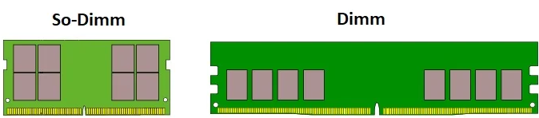
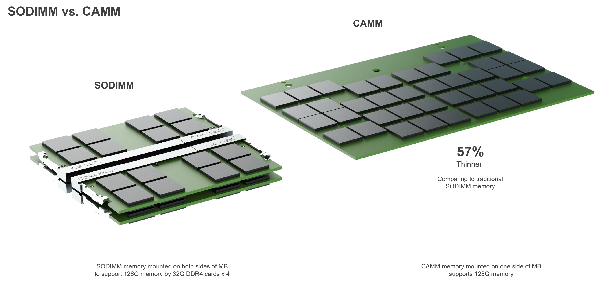
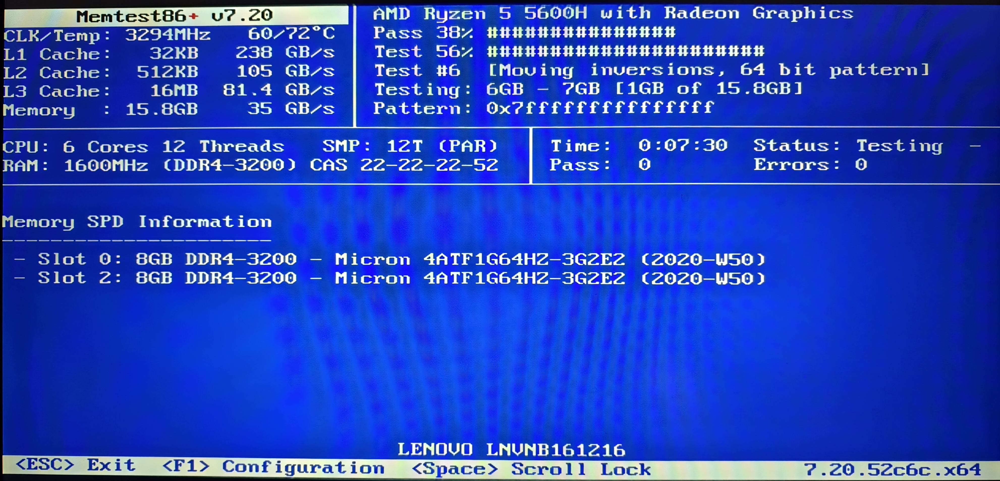
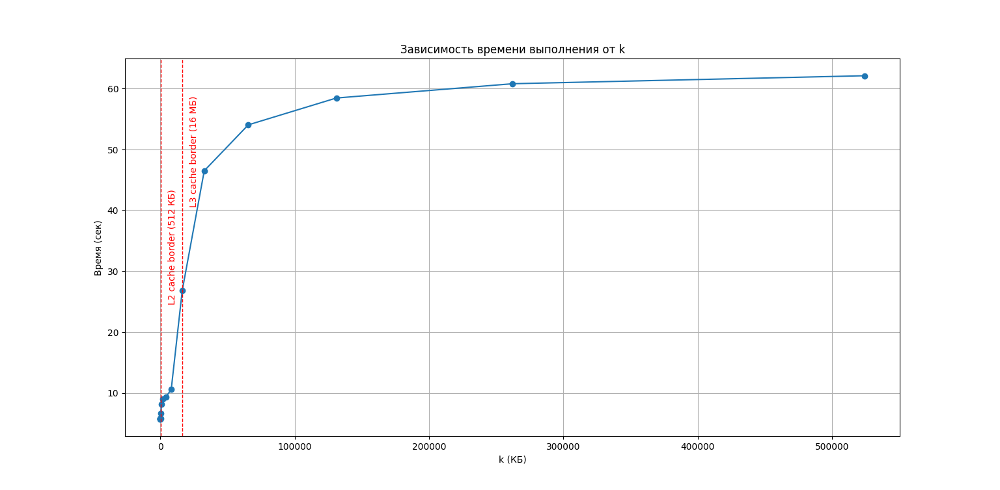
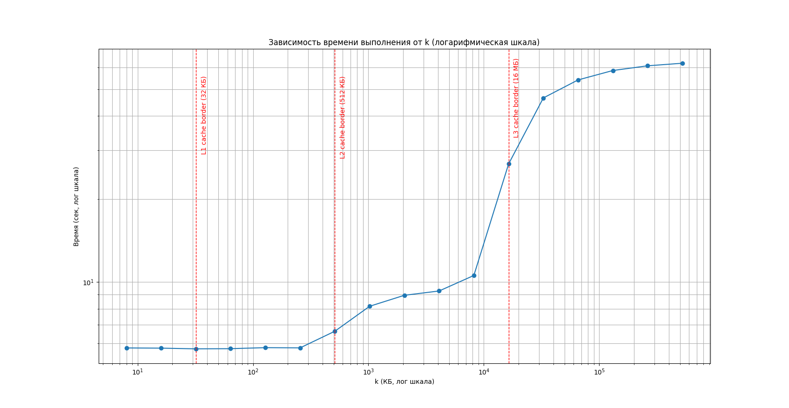

##### Национальный исследовательский ядерный университет «МИФИ» (Московский Инженерно-Физический Институт)

##### Кафедра №42 «Криптология и кибербезопасность»

---

### Лабораторная работа №3: «Память и кэш»

##### Антон Гатченко Б22-525

##### 2025 г.

---

#### Используемая рабочая среда

- Процессор - AMD Ryzen 5 5600H (laptop), 6c/12t
- Оперативная память – DDR4 16 ГБ
- ОС - Windows 10 Pro 22H2 19045.5608, 64 bit
- IDE – GCC/G++ 13.1

---

#### Теоретическая часть

1. > Определите размеры кэшей L1, L2, L3 для Вашего процессора. Проверьте, является ли L2 общим или отдельным для каждого ядра.

   Процессор - AMD Ryzen 5 5600H (laptop).

   Кэши 1 и 2 уровня - отдельные для каждого ядра.

   | Тип кэша        | Размер кэша (КБ) |
   | --------------- | ---------------- |
   | L3              | 16384            |
   | L2              | 6 x 512          |
   | L1 (данные)     | 6 x 32           |
   | L1 (инструкции) | 6 x 32           |

2. > Выясните, как записываются тайминги оперативной памяти и что означает каждый компонент этой записи?

   Тайминги оперативной памяти записываются в виде набора чисел, которые отражают задержки и временные интервалы, связанные с доступом к данным в ОЗУ. Эти числа представляются как последовательность значений, например: *CL - tRCD - tRP - tRAS*. Тайминги делятся на первичные и вторичные.

   Первичные тайминги являются основными параметрами, влияющими на производительность и эффективность работы оперативной памяти. Эти задержки зачастую указаны в спецификациях модулей памяти и могут быть изменены через BIOS или профили XMP/EXPO.

   Вторичные тайминги детализируют процессы внутри памяти и связаны с менее значимыми аспектами работы ОЗУ. Например, один из таких параметров — *tRFCPB*, который взаимодействует с первичным таймингом *tRFC2*. Влияние вторичных таймингов на общую производительность меньше, чем у первичных.

   Первичные тайминги:

   1. **CAS Latency (CL)** — это основной параметр таймингов, указывающий время между отправкой команды на чтение/запись информации и началом её выполнения. Это главный тайминг в работе памяти, который определяет, сколько тактов процессора потребуется для получения данных из ячеек памяти после запроса.
   2. **RAS to CAS Delay (tRCD)** — задержка между активацией строки (RAS) и столбца (CAS) в матрице памяти. Этот параметр определяет, насколько быстро система может переходить от одной части массива данных к другой.
   3. **Row Precharge Time (tRP)** — время, необходимое для подготовки новой строки памяти к работе после завершения работы с предыдущей строкой.
   4. **Row Active Time (tRAS)** — минимальное время, в течение которого строка должна оставаться активной после подачи сигнала активации. Это необходимо для корректного считывания или записи данных.

   Для моего ноутбука первичные тайминги следующие - 22-22-22-52 при частоте 3200 МГц (DDR4). Стандартным значением для десктопного решения было бы 3200 CL16.

   В моем старом ПК память DDR3 1600 МГц работает на таймингах 9-9-9-24.

3. > Выясните, что такое DDR

   **DDR (Double Data Rate)** — это технология, используемая в оперативной памяти, которая позволяет передавать данные с удвоенной скоростью по сравнению с предыдущими типами памяти. Это достигается за счет того, что данные передаются как на фронту, так и на спаде тактового сигнала синхронизации.

   DDR является одной из ключевых технологий, применяемых в современных вычислительных системах, и существует в нескольких поколениях: DDR, DDR2, DDR3, DDR4 и DDR5. Каждое новое поколение обеспечивает более высокую производительность, большую пропускную способность и улучшенное энергопотребление.

   Один из основных типов памяти, использующих эту технологию, называется **DDR SDRAM (Double Data Rate Synchronous Dynamic Random Access Memory)**. Эта технология стала стандартом для компьютерных систем.

4. > Выясните, что такое DIMM

   **DIMM (Dual In-line Memory Module)** — это форм-фактор модулей оперативной памяти, который пришёл на смену более старому форм-фактору SIMM (Single In-line Memory Module). DIMM представляет собой модуль памяти, используемый в персональных компьютерах для увеличения объёма оперативной памяти. 

   Модули DIMM предоставляют 64-битный канал данных, что значительно улучшает пропускную способность по сравнению с SIMM, который поддерживает только 32-битные каналы . Это позволяет передавать больше данных за один такт, что делает DIMM более эффективным и производительным решением.

   Внешне DIMM представляет собой печатную плату с контактами с обеих сторон, на которой размещены микросхемы памяти. Этот форм-фактор широко используется в настольных компьютерах, серверах и рабочих станциях благодаря поддержке различных типов памяти.

   Есть и другие форм-факторы RAM. **SO-DIMM (Small Outline DIMM)** — это компактный форм-фактор модулей оперативной памяти, который широко используется в ноутбуках и других портативных устройствах благодаря своим меньшим размерам. Он занимает примерно половину пространства от стандартного DIMM, что делает его лучшим выбором для устройств с ограниченным пространством. Других значительных отличий между ними нет.

   

   Преемником SODIMM может стать **CAMM2 (Compression Attached Memory Module)**. CAMM2 обеспечивает более высокую плотность размещения памяти, позволяя устанавливать до 128 ГБ на одном модуле, что значительно превышает возможности SO-DIMM. Кроме того, CAMM2 поддерживает более высокие скорости передачи данных и обладает тонким профилем, что способствует созданию более компактных и энергоэффективных устройств. Ожидается, что CAMM2 постепенно заменит SO-DIMM в ноутбуках и других портативных устройствах.

   

5. > Зная тактовую частоту своего процессора и размеры регистров, оцените, какая пропускная способность памяти требуется, чтобы полностью загрузить одно процессорное ядро? Все процессорные ядра?

   Базовая частота моего процессора - 3.3 ГГц. Процессор (ядро) может выполнять за один такт сложение/вычитание/сравнение двух 64-битных чисел, то есть 16 байт. Если он выполняет эти операции на данных, загруженных из оперативной памяти, это приводит к потребности в пропускной способности 16 байт * 3.3 ГГц = 52.8 ГБ/с на чтение.
   
   Для 6 ядер это значение вырастет в 6 раз: 52.8 ГБ/с * 6 = 316.8 ГБ/с.
   
   Для сложения и вычитания, если мы помещаем результат обратно в память (64 бита), необходимо еще 26.4 ГБ/с на запись. Кроме того, стоит учитывать размер команды/инструкции. На примере сложения - команда ADD занимает 3 байта (4 в ARM).

----

#### Практическая часть

1. > Используйте программу `memtest86+` для определения пропускной способности кэшей L1, L2, L3 и оперативной памяти. Сравните измеренные Вами показатели с рассчитанной теоретически пропускной способностью, которая требуется, чтобы полностью загрузить процессор. Сделайте выводы.

   

   | Вид памяти         | Пропускная способность (ГБ/с) |
   | ------------------ | ----------------------------- |
   | L1 кэш             | 238                           |
   | L2 кэш             | 105                           |
   | L3 кэш             | 81.4                          |
   | Оперативная память | 35                            |

   Пропускной способности оперативной памяти не хватит даже на полную загрузку одного ядра. L3 кэш сможет обеспечить нужный уровень для одного ядра. Для 2 ядер почти хватит скорости L2 кэша. Однако даже L3 кэш недостаточно быстр для всех 6 ядер, его хватит лишь для 4 ядер.

2. > Определите тайминги, на которые настроена Ваша оперативная память. Также определите тактовую частоту, на которой она работает.

   DDR4 3200 МГц, тайминги 22-22-22-52-74 для CL-tRCD-tRP-tRAS-tRC, 1T Command Rate (CR).

3. > Используя эти сведения, оцените примерное время выполнения разных функций оперативной памяти в нс

   При использовании DDR4‑3200 с базовой частотой 1600 МГц (помним, что эффективная частота (3200 МГц) = базовая частота (1600 МГц) * 2), что даёт период ≈ 0.625 нс, можно оценить временные задержки как цикл * 0.625 нс:

   | Параметр                 | Количество тактов | Время (нс) |
   | ------------------------ | ----------------- | ---------- |
   | CAS Latency (CL)         | 22                | 13.75      |
   | RAS to CAS Delay (tRCD)  | 22                | 13.75      |
   | Row Precharge Time (tRP) | 22                | 13.75      |
   | Row Active Time (tRAS)   | 52                | 32.5       |
   | Row Cycle Time (tRC)     | 74                | 46.25      |

4. > Напишите программу, которая работает следующим образом:
   >
   > - загружает в память файл большого размера (подойдёт длинная видеозапись);
   > - в длинном цикле фиксированной длины читает из этого файла по 8 байт, используя произвольные адреса от (a) до (a+k), где (a) — фиксированное смещение, выбранное произвольным образом;
   > - выявите зависимость времени работы программы от (k). Начните с небольшого (k), примерно равного половине размера L1. Последний эксперимент проведите для (k) >> L3;
   > - пронаблюдайте, как меняется время работы программы с ростом (k), особенно когда (k) начинает превышать размер L1, L2, L3.

   Код программы на C++ представлен в [Приложении 1](#Приложение-1).
   
   Графики времени выполнения:
   
   
   
   

----

#### Заключение

В ходе выполнения лабораторной работы были проведены теоретические и практические исследования на тему иерархии памяти в современных компьютерах. С помощью программы `memtest86+` были найдены скорости различных уровней кэша и оперативной памяти (L1: 238 ГБ/с, L2: 105 ГБ/с, L3: 81.4 ГБ/с, ОЗУ: 35 ГБ/с). Затем была написана программа для измерения влияния кэшей на её время выполнения. Произведенные замеры показали зависимость производительности от взаимодействия с разными уровнями кэша и оперативной памяти.

При малых значениях k до 256 КБ время выполнения оставалось стабильным (5.7–5.8 секунд), что связано с эффективным использованием кэшей L1 (32 КБ) и L2 (512 КБ). Незначительный рост при k = 512 КБ (6.6 секунды) и далее указывает на переход к L3 кэшу.

При изменении k от 8 до 16 МБ происходит сильный скачок с 10.5 до почти 27 секунд, затем, при 32 МБ, это значение поднимается до 46.5 секунд. Размер L3 кэша - 16 МБ, поэтому подобные изменения ожидаемы. При последующем увеличении k от 64 до 512 МБ время выполнения растет не так сильно, меняясь от 54 до 62 секунд, что логично, поскольку программа работает с оперативной памятью, и при росте объемов данных пропускная способность и задержки уже не меняются.

Полученные данные подчеркивают критическую роль кэширования в обеспечении производительности приложений. Эффективное использование кэш-памяти позволяет минимизировать задержки при доступе к данным, особенно при обработке больших объемов информации. Например, последовательный доступ к данным в пределах кэш-линий может снизить количество промахов кэша.

Практические результаты демонстрируют четкую зависимость времени выполнения программы от размера обрабатываемых данных и подтверждают теоретические ожидания о роли кэш-памяти. Переход от кэшей к оперативной памяти приводит к значительному падению скорости выполнения, что демонстрирует важность оптимизации программ для работы в пределах доступных уровней кэша.

----

#### Приложение

1. <a id="Приложение-1">Исходный код программы для замеров времени выполнения программы от k.</a>

   ```C++
   #include <iostream>
   #include <fstream>
   #include <vector>
   #include <cstdint>
   #include <chrono>
   #include <stdexcept>
   
   #define ITERATIONS (int) 1e9
   #define SEED (int) 424242
   #define L1_SIZE (int) (16 * 1024)
   #define MAX_K (40 * 16 * 1024 * 1024)  // Максимальный k = 640 МБ, в 40 раз больше размера L3 кэша
   
   // Линейный конгруэнтный генератор (LCG)
   class LCG {
   private:
   	uint64_t state;
   	static constexpr uint64_t a = 1664525;
   	static constexpr uint64_t c = 1013904223;
   	static constexpr uint64_t m = 1ULL << 32;
   
   public:
   	explicit LCG(const uint64_t seed) : state(seed){}
   
   	uint64_t next(){
   		state = (a * state + c) % m;
   		return state;
   	}
   };
   
   // Функция для загрузки файла в буфер
   std::vector<unsigned char> loadFile(const std::string &filename){
   	std::ifstream file(filename, std::ios::binary | std::ios::ate);
   
   	if (!file){
   		throw std::runtime_error("Failed to open file");
   	}
   
   	const uint64_t file_size = file.tellg();
   	file.seekg(0, std::ios::beg);
   	std::vector<unsigned char> buffer(file_size);
   	file.read(reinterpret_cast<char *>(buffer.data()), file_size);
   	return buffer;
   }
   
   // Функция для выполнения одного эксперимента с заданным значением k.
   // outSum передаёт накопленную сумму прочитанных значений для предотвращения оптимизации.
   double runExperiment(const uint64_t &k, const std::vector<unsigned char> &buffer, const uint64_t &initial_offset,
                        LCG &rng, uint64_t &outSum){
   	outSum = 0;
   	const auto start = std::chrono::high_resolution_clock::now();
   
   	for (uint64_t i = 0; i < ITERATIONS; ++i){
   		// Генерация смещения в диапазоне [initial_offset, initial_offset + k)
   		uint64_t offset = initial_offset + rng.next() % k;
   		offset -= offset % 8; // Выравнивание по 8 байт
   
   		// Проверка границ буфера
   		if (offset + 8 > buffer.size()){
   			offset = buffer.size() - 8;
   		}
   
   		// Чтение 8 байт и суммирование для предотвращения оптимизации
   		const uint64_t value = *reinterpret_cast<const uint64_t *>(&buffer[offset]);
   		outSum += value;
   	}
   
   	const auto end = std::chrono::high_resolution_clock::now();
   	const std::chrono::duration<double> elapsed = end - start;
   	return elapsed.count();
   }
   
   // Функция для проведения серии экспериментов с различными значениями k.
   void performExperiments(const std::vector<unsigned char> &buffer){
   	LCG rng(SEED);
   	uint64_t initial_offset = rng.next();
   	initial_offset %= (buffer.size() - MAX_K);
   
   	// Выравнивание initial_offset до кратности 8
   	initial_offset -= initial_offset % 8;
   
   	uint64_t sum = 0;
   
   	for (uint64_t k = L1_SIZE / 2; k <= MAX_K; k *= 2){
   		const double elapsedTime = runExperiment(k, buffer, initial_offset, rng, sum);
   		std::cout << "k = " << k << " | Time: " << elapsedTime << " s | Sum: " << sum << "\n";
   	}
   }
   
   int main(){
   	const std::string filename = "Berserk 10.mkv";
   
   	try{
   		const std::vector<unsigned char> buffer = loadFile(filename);
   		performExperiments(buffer);
   	} catch (const std::exception &e){
   		std::cerr << e.what() << "\n";
   		return 1;
   	}
   
   	return 0;
   }
   ```
