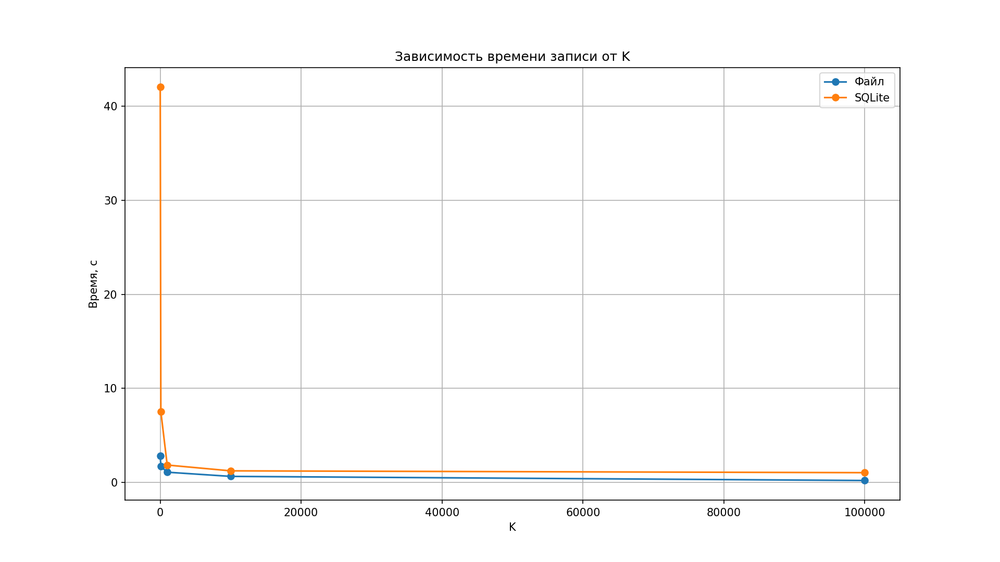

##### Национальный исследовательский ядерный университет «МИФИ» (Московский Инженерно-Физический Институт)

##### Кафедра №42 «Криптология и кибербезопасность»

---

### Лабораторная работа №4: «SQLite3»

##### Антон Гатченко Б22-525

##### 2025 г.

---

#### Используемая рабочая среда:

- Процессор - AMD Ryzen 5 5600H (laptop), 6c/12t
- Оперативная память – DDR4 16 ГБ
- ОС - Windows 10 Pro 22H2 19045.5608, 64 bit
- IDE – GCC/G++ 13.1

---

#### Ход работы:

В ходе работы генерировался массив строк размером $500-550$ МБ. При увеличении $K$ (максимального размера строки) от $10$ до $10^6$ символов целевой размер не менялся, что естественным образом уменьшало количество записываемых строк. Искомая подстрока для всех $K$ - `abc`.

Исходный код программы для замеров времени выполнения можно найти в [Приложении 1](#Приложение-1).

Время выполнения не зависело от порядка запуска функций, поэтому отдельные графики для разного порядка не приведены. Исходные результаты замеров расположены в [Приложении 2](#Приложение-2).

#### Графики зависимости времени выполнения действий от $K$ для обычного файла и базы данных `SQLite`:




#### Графики с логарифмической шкалой:


#### Графики без учета $K=10$ (для улучшения читаемости остальных значений):


----

#### Заключение

В ходе выполнения лабораторной работы было произведено сравнение производительности между обычным файлом и базой данных `SQLite3`.

Запись данных всегда намного быстрее при использовании обычного файла: при $K=10$ время записи составляет $≈2.8$ сек для файла против $≈42$ сек для `SQLite`, разница в $15$ раз. Для $K=100$ и дальше разница сокращается, но остается значительной: файл – $≈1.7$ сек, `SQLite` – $≈7.5$ сек ( `SQLite` в $4.4$ раза медленнее). Для $K=100000$ файл быстрее в $5$ раз – $0.2$ сек против $1.0$ сек.

Чтение показывает иные результаты: при бóльшем количестве записей файл быстрее, однако при их уменьшении тенденция меняется на противоположную. Для $K=10$ чтение файла занимает около $≈8$ сек, а SQLite – $≈10$ сек, что на $21\%$ медленнее. При $K=1000$ разница практически исчезает: файл – $≈1.01$ сек, `SQLite` – $≈0.93$ сек, а для $K=100000$ `SQLite` обходит файл ($0.54$ сек против $0.68$ сек), примерно на $20\%$ быстрее.

Поиск подстроки схож с чтением. При $K=10$ поиск подстроки в файле занимает $≈2.9$ сек против $≈5.0$ сек для `SQLite`, то есть поиск в файле выполняется в $1.75$ раза быстрее. При $K=1000$ результаты почти совпадают ($≈0.99$ сек для файла против $≈0.93$ сек для `SQLite`), а при $K=100000$ `SQLite` показывает небольшое преимущество – поиск выполняется за $0.8$ сек против $0.9$ сек, что на $11\%$ быстрее.

В целом, на большом количестве мелких данных обычный файл оказывается гораздо производительнее `SQLite`, однако при снижении количества записей (с сохранением общего объема данных) `SQLite` оказывается быстрее.

В итоге выбор между файлом и `SQLite` должен основываться на конкретных требованиях приложения: для простых последовательных операций с мелкими записями оптимальным может оказаться файловый ввод-вывод, а для комплексных запросов и операций чтения — `SQLite`.

----

#### Приложение

1. <a id="Приложение-1">Исходный код программы для сравнения времени записи, чтения и поиска подстроки в обычный файл и базу данных `SQLite3`</a>

```c++
#include <iostream>
#include <fstream>
#include <string>
#include <vector>
#include <random>
#include <chrono>
#include <cstdio>
#include <cstring>
#include "sqlite/sqlite3.h"

#define LENGTH_SEED 424242
#define CHAR_SEED 909090

#define MAX_STRING_LENGTH 10
#define AVERAGE_RECORD_SIZE (MAX_STRING_LENGTH / 2 + 3)
#define NUM_STRINGS (TARGET_BYTES / AVERAGE_RECORD_SIZE)
#define TARGET_BYTES (500 * 1024 * 1024)  // Целевой объём данных
#define CHARSET "ABCDEFGHIJKLMNOPQRSTUVWXYZabcdefghijklmnopqrstuvwxyz0123456789"
#define CHARSET_SIZE (sizeof(CHARSET) - 1)

#define FILENAME "../file.txt"
#define DB_FILENAME "../database.db"

using namespace std;

string generate_random_string(const int &len){
	static mt19937 gen(CHAR_SEED);
	static uniform_int_distribution<> char_dist(0, CHARSET_SIZE - 1);

	string str;
	str.reserve(len);

	for (int i = 0; i < len; ++i){
		str.push_back(CHARSET[char_dist(gen)]);
	}

	return str;
}

void generate_data(vector<string> &records){
	auto gen_start = chrono::high_resolution_clock::now();

	records.resize(NUM_STRINGS);
	mt19937 gen(LENGTH_SEED);
	uniform_int_distribution length_dist(1, MAX_STRING_LENGTH);

#pragma omp parallel for num_threads(12)
	for (size_t i = 0; i < NUM_STRINGS; i++){
		int len = length_dist(gen);
		string s = generate_random_string(len);
		string record = to_string(len) + " " + s + "\n";
		records[i] = record;
	}

	auto gen_end = chrono::high_resolution_clock::now();
	chrono::duration<double> gen_duration = gen_end - gen_start;
	cout << "Generated in " << gen_duration.count() << " seconds" << endl;
}

void write_data(const vector<string> &records){
	ofstream ofs(FILENAME, ios::binary);

	if (!ofs){
		cerr << "Ошибка открытия файла для записи." << endl;
		return;
	}

	auto write_start = chrono::high_resolution_clock::now();

	for (const auto &record: records){
		ofs.write(record.c_str(), record.size());
	}

	auto write_end = chrono::high_resolution_clock::now();
	chrono::duration<double> write_duration = write_end - write_start;
	cout << "Wrote in " << write_duration.count() << " seconds" << endl;

	ofs.close();
}

void read_data(){
	ifstream ifs(FILENAME, ios::binary);

	if (!ifs){
		cerr << "Ошибка открытия файла для чтения." << endl;
		return;
	}

	vector<string> records;
	records.reserve(NUM_STRINGS);

	auto read_start = chrono::high_resolution_clock::now();

	while (ifs.good()){
		string str;
		if (std::getline(ifs, str)){
			if (!str.empty()){
				records.push_back(str);
			}
		}
	}

	auto read_end = chrono::high_resolution_clock::now();
	chrono::duration<double> read_duration = read_end - read_start;
	cout << "Read in " << read_duration.count() << " seconds (length: " << records.size() << ")" << endl;

	ifs.close();
}

void write_data_sqlite(const vector<string> &records){
	sqlite3 *db = nullptr;

	if (sqlite3_open(DB_FILENAME, &db) != SQLITE_OK){
		std::cerr << "ERROR opening database" << std::endl;
		return;
	}

    char drop_table_sql[] = "DROP TABLE IF EXISTS records;";
	char *errMsg = nullptr;

	if (sqlite3_exec(db, drop_table_sql, nullptr, nullptr, &errMsg) != SQLITE_OK) {
		std::cerr << "ERROR dropping table: " << errMsg << std::endl;
		sqlite3_free(errMsg);
		sqlite3_close(db);
		return;
	}

	char create_table_sql[128];

	std::snprintf(create_table_sql, sizeof(create_table_sql),
	              "CREATE TABLE IF NOT EXISTS records ("
	              "id INTEGER PRIMARY KEY AUTOINCREMENT, "
	              "data VARCHAR(%d)"
	              ");", MAX_STRING_LENGTH);

	if (sqlite3_exec(db, create_table_sql, nullptr, nullptr, &errMsg) != SQLITE_OK){
		std::cerr << "ERROR creating table: " << errMsg << std::endl;
		sqlite3_free(errMsg);
		sqlite3_close(db);
		return;
	}

	const char *insert_sql = "INSERT INTO records(data) VALUES (?);";
	sqlite3_stmt *stmt = nullptr;

	if (sqlite3_prepare_v2(db, insert_sql, -1, &stmt, nullptr) != SQLITE_OK){
		std::cerr << "ERROR preparing insert statement" << std::endl;
		sqlite3_close(db);
		return;
	}

	sqlite3_exec(db, "BEGIN TRANSACTION;", nullptr, nullptr, nullptr);

	auto start_time = std::chrono::high_resolution_clock::now();

	for (const auto &s: records){
		sqlite3_bind_text(stmt, 1, s.c_str(), -1, SQLITE_TRANSIENT);

		if (sqlite3_step(stmt) != SQLITE_DONE){
			std::cerr << "ERROR inserting record" << std::endl;
		}

		sqlite3_reset(stmt);
	}

	sqlite3_exec(db, "COMMIT;", nullptr, nullptr, nullptr);

	auto end_time = std::chrono::high_resolution_clock::now();
	std::chrono::duration<double> insert_duration = end_time - start_time;
	std::cout << "SQL wrote in " << insert_duration.count() << " seconds" << std::endl;

	sqlite3_finalize(stmt);
	sqlite3_close(db);
}

void read_data_sqlite(){
	sqlite3 *db = nullptr;

	if (sqlite3_open(DB_FILENAME, &db) != SQLITE_OK){
		cerr << "ERROR opening database" << endl;
		return;
	}

	const char *query_sql = "SELECT data FROM records;";
	sqlite3_stmt *stmt = nullptr;

	if (sqlite3_prepare_v2(db, query_sql, -1, &stmt, nullptr) != SQLITE_OK){
		cerr << "ERROR preparing query" << endl;
		sqlite3_close(db);
		return;
	}

	vector<string> records;
	records.reserve(NUM_STRINGS);

	auto start_time = chrono::high_resolution_clock::now();

	while (sqlite3_step(stmt) == SQLITE_ROW){
		const unsigned char *data_text = sqlite3_column_text(stmt, 0);
		records.emplace_back(reinterpret_cast<const char *>(data_text));
	}

	auto end_time = chrono::high_resolution_clock::now();
	chrono::duration<double> read_duration = end_time - start_time;
	cout << "SQL read in " << read_duration.count() << " seconds (length: " << records.size() << ")" << endl;

	sqlite3_finalize(stmt);
	sqlite3_close(db);
}

void read_data_with_substring(const string &substr){
	std::ifstream ifs(FILENAME, std::ios::binary);

	if (!ifs){
		std::cerr << "ERROR opening file" << std::endl;
		return;
	}

	vector<string> selected_records;
	selected_records.reserve(69144);

	auto start_time = std::chrono::high_resolution_clock::now();

	string line;

	while (std::getline(ifs, line)){
		if (std::strstr(line.c_str(), substr.c_str()) != nullptr){
			selected_records.push_back(line);
		}
	}

	auto end_time = std::chrono::high_resolution_clock::now();
	std::chrono::duration<double> duration = end_time - start_time;
	std::cout << "Substring searched in " << duration.count()
			<< " seconds (length: " << selected_records.size() << ")" << std::endl;

	ifs.close();
}

void read_data_sqlite_with_substring(const string &substr){
	sqlite3 *db = nullptr;

	if (sqlite3_open(DB_FILENAME, &db) != SQLITE_OK){
		std::cerr << "ERROR opening database" << std::endl;
		return;
	}

	// Формируем SQL-запрос с оператором LIKE для поиска подстроки
	// Используем шаблон '*<substr>*'
	string glob_pattern = "*" + substr + "*";
	string query_sql = "SELECT data FROM records WHERE data GLOB '" + glob_pattern + "';";
	sqlite3_stmt *stmt = nullptr;

	if (sqlite3_prepare_v2(db, query_sql.c_str(), -1, &stmt, nullptr) != SQLITE_OK){
		std::cerr << "ERROR preparing query" << std::endl;
		sqlite3_close(db);
		return;
	}

	vector<string> selected_records;
	selected_records.reserve(69144);

	auto start_time = std::chrono::high_resolution_clock::now();

	while (sqlite3_step(stmt) == SQLITE_ROW){
		const unsigned char *data_text = sqlite3_column_text(stmt, 0);
		if (data_text){
			selected_records.emplace_back(reinterpret_cast<const char *>(data_text));
		}
	}

	auto end_time = std::chrono::high_resolution_clock::now();
	std::chrono::duration<double> duration = end_time - start_time;

	std::cout << "SQL substring searched in " << duration.count()
			<< " seconds (length: " << selected_records.size() << ")" << std::endl;

	sqlite3_finalize(stmt);
	sqlite3_close(db);
}

int main(){
	// vector<string> records;
	// records.reserve(NUM_STRINGS);
	// generate_data(records);
	//
	// write_data(records);
	// write_data_sqlite(records);

	read_data_sqlite();
	read_data();

	// const string substr = "abc";
	// read_data_with_substring(substr);
	// read_data_sqlite_with_substring(substr);

	return 0;
}
```

2. <a id="Приложение-2">Исходные результаты замеров</a>

```txt
k = 10
Wrote in 2.80722 seconds
SQL wrote in 42.0467 seconds

SQL wrote in 42.0188 seconds
Wrote in 2.87808 seconds

Read in 7.93401 seconds (length: 65536000)
SQL read in 10.9868 seconds (length: 65536000)

SQL read in 9.46458 seconds (length: 65536000)
Read in 8.19297 seconds (length: 65536000)

Substring searched in 2.85411 seconds (length: 935)
SQL substring searched in 4.98044 seconds (length: 935)

SQL substring searched in 5.11754 seconds (length: 935)
Substring searched in 2.90944 seconds (length: 935)
--------------------
k = 100

Wrote in 1.70519 seconds
SQL wrote in 7.50258 seconds

SQL wrote in 7.52952 seconds
Wrote in 1.69453 seconds

Read in 2.91097 seconds (length: 9892226)
SQL read in 2.64206 seconds (length: 9892226)

SQL read in 2.73019 seconds (length: 9892226)
Read in 3.03091 seconds (length: 9892226)

Substring searched in 1.32472 seconds (length: 1914)
SQL substring searched in 1.52 seconds (length: 1914)

SQL substring searched in 1.52292 seconds (length: 1914)
Substring searched in 1.33326 seconds (length: 1914)
--------------------
k = 1000

Wrote in 1.07817 seconds
SQL wrote in 1.8865 seconds

SQL wrote in 1.81327 seconds
Wrote in 1.09765 seconds

Read in 1.01622 seconds (length: 1042322)
SQL read in 0.954191 seconds (length: 1042322)

SQL read in 0.913636 seconds (length: 1042322)
Read in 1.00248 seconds (length: 1042322)

Substring searched in 0.992491 seconds (length: 1990)
SQL substring searched in 0.937353 seconds (length: 1990)

SQL substring searched in 0.930782 seconds (length: 1990)
Substring searched in 0.984359 seconds (length: 1990)
--------------------
k = 10000

Wrote in 0.615567 seconds
SQL wrote in 1.18977 seconds

SQL wrote in 1.27435 seconds
Wrote in 0.670237 seconds

Read in 0.74127 seconds (length: 104794)
SQL read in 0.7121 seconds (length: 104794)

SQL read in 0.700851 seconds (length: 104794)
Read in 0.749723 seconds (length: 104794)

Substring searched in 0.937933 seconds (length: 1943)
SQL substring searched in 0.905096 seconds (length: 1943)

SQL substring searched in 0.901756 seconds (length: 1943)
Substring searched in 0.925795 seconds (length: 1943)
--------------------
k = 100000

Wrote in 0.205199 seconds
SQL wrote in 0.957213 seconds

SQL wrote in 1.1198 seconds
Wrote in 0.203803 seconds

Read in 0.687028 seconds (length: 10485)
SQL read in 0.53162 seconds (length: 10485)

SQL read in 0.547093 seconds (length: 10485)
Read in 0.674233 seconds (length: 10485)

Substring searched in 0.917425 seconds (length: 1755)
SQL substring searched in 0.799523 seconds (length: 1755)

SQL substring searched in 0.810559 seconds (length: 1755)
Substring searched in 0.902231 seconds (length: 1755)
```
