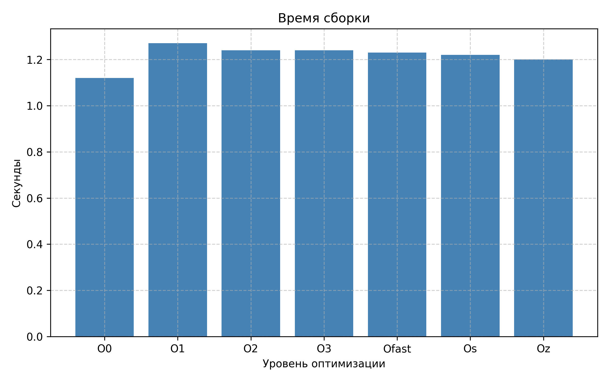
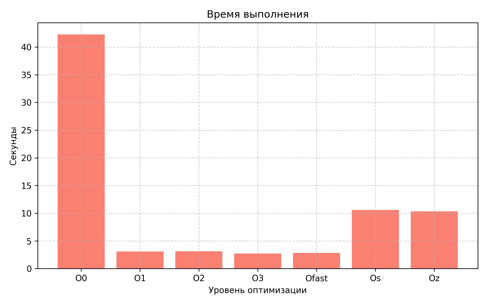
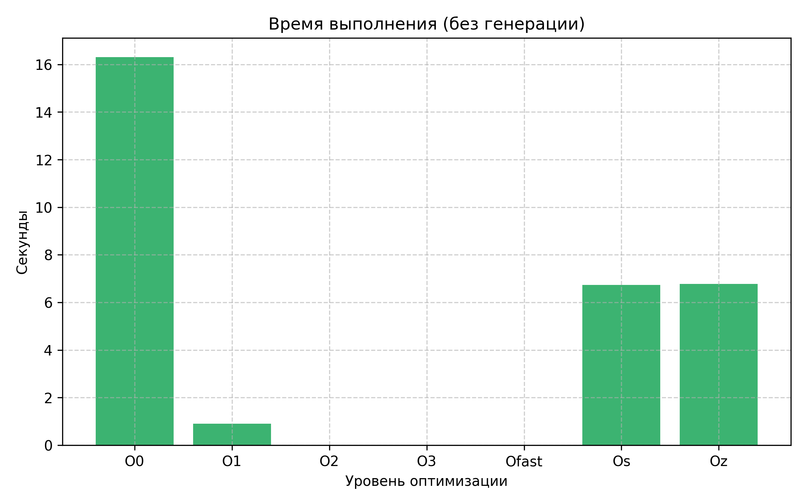
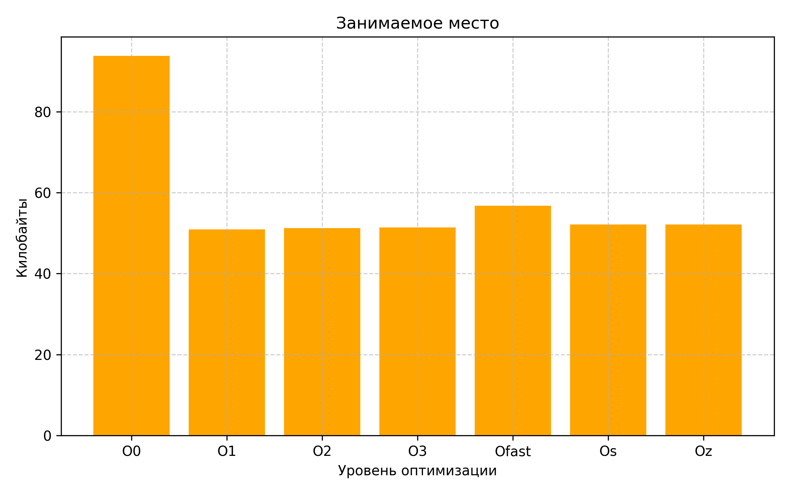
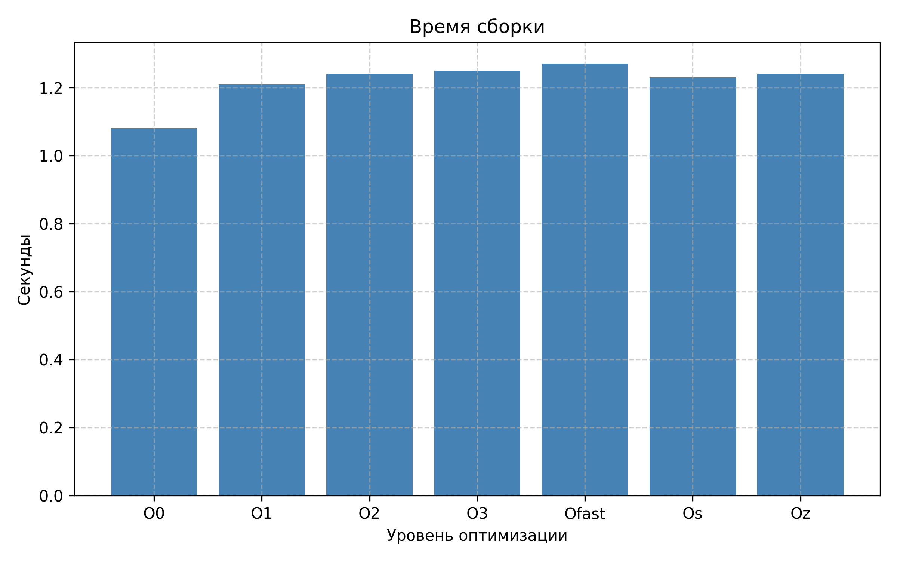
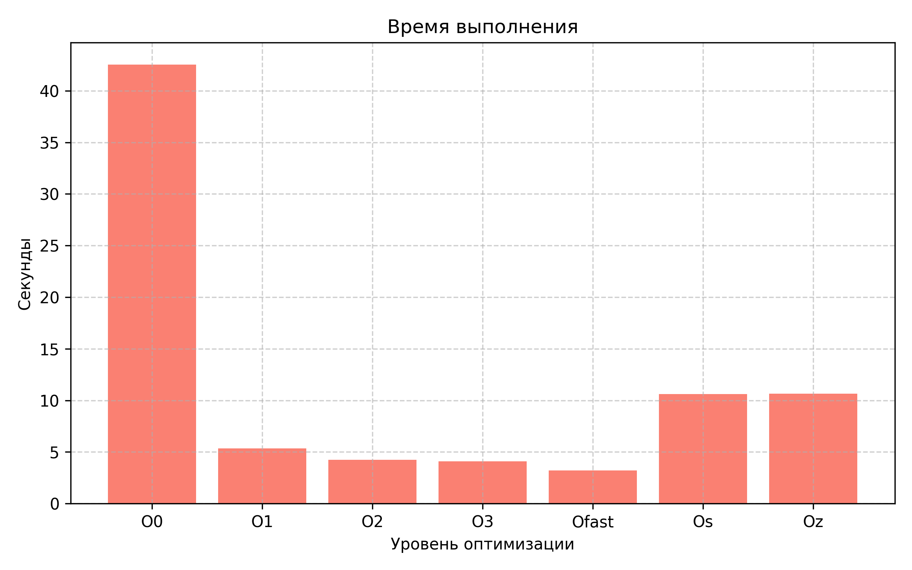
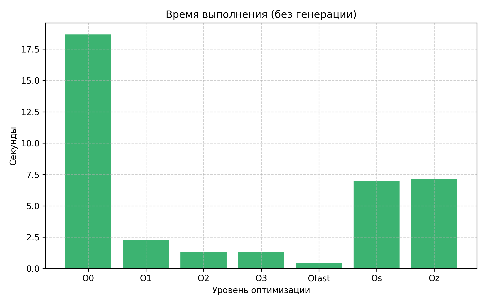
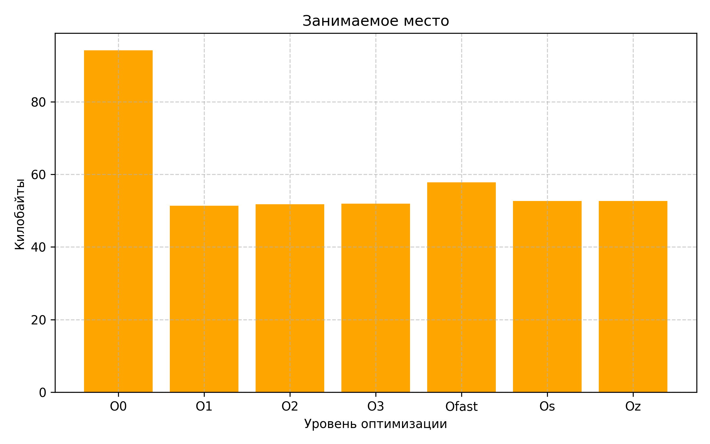

##### Национальный исследовательский ядерный университет «МИФИ» (Московский Инженерно-Физический Институт)

##### Кафедра №42 «Криптология и кибербезопасность»

---

### Лабораторная работа №7: «Оптимизация при компиляции»

##### Антон Гатченко Б22-525

##### 2025 г.

---

#### Используемая рабочая среда:

- Процессор - AMD Ryzen 5 5600H (laptop), 6c/12t
- Оперативная память – DDR4 16 ГБ
- ОС - Windows 10 Pro 22H2 19045.5608, 64 bit
- IDE – GCC/G++ 13.1

---

#### Практическая часть:

Для таймирования сборки и выполнения программы использовалась программа для решения квадратных уравнений, написанная на C++. Её исходный код расположен в [Приложении 1](#Приложение-1). Время сборки усреднялось по 5 пробегам, время выполнения программы - по 3.

Таймирование было автоматизировано с помощью Powershell-скрипта. Его можно найти в [Приложении 2](#Приложение-2).

Были таймированы два варианта программы: в первом корни ни для чего не использовались, во втором сумма их разности сохранялась и выводилась при завершении программы (однако злой рандом крайне часто дает корни, равные `nan` и `+-inf`, из-за чего далеко не все числа попадают в сумму). Учитывалось время как с генерацией числового массива коэффициентов, так и без него.

Первый вариант (корни не используются):

| Уровень оптимизации | Время сборки (с) | Время выполнения (с) | Время выполнения (без генерации) (с) | Занимаемое место (КБ) |
| ------------------- | ---------------- | -------------------- | ------------------------------------ | --------------------- |
| O0                  | 1.12             | 42.28                | 16.3                                 | 93.78                 |
| O1                  | 1.27             | 3.09                 | 0.9                                  | 50.89                 |
| O2                  | 1.24             | 3.12                 | 0                                    | 51.24                 |
| O3                  | 1.24             | 2.71                 | 0                                    | 51.42                 |
| Ofast               | 1.23             | 2.83                 | 0                                    | 56.78                 |
| Os                  | 1.22             | 10.57                | 6.74                                 | 52.13                 |
| Oz                  | 1.20             | 10.34                | 6.78                                 | 52.13                 |

Второй вариант (считается сумма разности корней):

| Уровень оптимизации | Время сборки (с) | Время выполнения (с) | Время выполнения (без генерации) (с) | Занимаемое место (КБ) |
| ------------------- | ---------------- | -------------------- | ------------------------------------ | --------------------- |
| O0                  | 1.08             | 42.54                | 18.66                                | 94.17                 |
| O1                  | 1.21             | 5.35                 | 2.25                                 | 51.39                 |
| O2                  | 1.24             | 4.23                 | 1.34                                 | 51.74                 |
| O3                  | 1.25             | 4.09                 | 1.34                                 | 51.92                 |
| Ofast               | 1.27             | 3.21                 | 0.47                                 | 57.78                 |
| Os                  | 1.23             | 10.61                | 6.98                                 | 52.63                 |
| Oz                  | 1.24             | 10.65                | 7.11                                 | 52.63                 |

Примечательно, что при использовании флага `-Ofast` вторая программа выдала сумму `nan`, хотя для всех остальных флагов она была равна $-60.1736$. Вот и проявилась цена небезопасных оптимизаций.

#### Графики:

Первый вариант программы:









Второй вариант программы:









---

#### Случай из жизни:

В 4 семестре у нас проводился курс по Ассемблеру. В рамках одной из лабораторных необходимо было написать одну часть кода на C с вызовом внешней функции, вторую часть на Ассемблере с этой функцией. Скомпилированная из объектных файлов  с флагом `-O0` программа работала замечательно, но медленнее, чем хотелось. После установки флага `-O1`, либо более высоких уровней оптимизации, программа вылетала с ошибкой. Как оказалось, в ассемблерной части я забыл возвращать значение регистров `r12-r15`, что и приводило к завершению программы. Скорее всего на `-O0` всё работало, т.к. происходили последовательные вызовы, и значения этих регистров ни на что не влияли (хотя часть кода на C все равно могла их использовать, но видимо "повезло").

----

#### Заключение

В ходе выполнения лабораторной работы была написана программа на C++ для выполнения математических операций. Были измерены время сборки, выполнения программы и вес итогового исполняемого файла.

Для первого варианта программы виден огромный скачок производительности при переходе с `-O0` на `-O1`, общее время выполнения уменьшилось в $14$ раз, без учета генерации массивов - в $18$ раз. Также занимаемое место уменьшилось в $1.86$ раза, а время сборки увеличилось всего на $0.15$ секунды, чуть более $10$%. Время выполнения после `-O2` включительно стало крайне малым, видимо оптимизации полностью избавились от вычисления корней, поскольку их результат не используется. Далее видно улучшение времени выполнения на $10$% с уровня `-O2` на `-O3`. `-Ofast` показал результаты чуть хуже `-O3` как по времени выполнения, так и по объему занимаемого места.

Уровни `-Os` и `-Oz` оказались практически идентичными, по размеру исполняемого файла - совершенно одинаковые, однако примечательно, что размер файла выше, чем у уровней `-O1`, `-O2`, `-O3`. Время выполнения ожидаемо хуже, чем у остальных уровней (кроме `-O0`) - более чем в $3$ раза.

Для второго варианта программы выполняются те же закономерности, однако прирост производительности более скромный: с `-O0` на `-O1` общее время выполнения уменьшилось в $8$ раз, без учета генерации массивов - в $8.3$ раза. Занимаемое место уменьшилось в $1.83$ раза, а время сборки увеличилось на $0.13$ секунды. Уровни `-O2`, `-O3` теперь не показывают околонулевое время выполнения без учета генерации, хотя прирост относительно `-O1` существенный, время уменьшилось в $1.68$ раза без учета генерации. В этом варианте `-Ofast` показал отличный результат, время выполнения уменьшилось практически в $3$ раза относительно `-O3`, однако не стоит забывать о том, что скомпилированная с этим флагом программа выдала `nan` в качестве суммы, отличившись от остальных вариантов, так что этот результат может быть не совсем "честным".

На таком синтетическом примере использование флагов оптимизаций практически не увеличивает времени компиляции, а прирост производительности крайне велик. Однако стоит проверять уровни `-O3` и `-Ofast` на внезапные результаты из-за их небезопасных оптимизаций.

----

#### Приложение

1. <a id=Приложение-1>Исходный код программы</a>

```C++
#include <iostream>
#include <vector>
#include <array>
#include <random>
#include <chrono>
#include <immintrin.h>
#include <omp.h>

#define SIZE 3e8
#define SEED 15032025

using std::vector, std::array, std::cout, std::endl;

double calculateDiscriminant(double a, double b, double c){
    return b * b - 4 * a * c;
}

double calculateRoot1(double a, double b, double discriminant){
    if (discriminant >= 0){
        return (-b + sqrt(discriminant)) / (2 * a);
    }
    return nan("");
}

double calculateRoot2(double a, double b, double discriminant){
    if (discriminant >= 0){
        return (-b - sqrt(discriminant)) / (2 * a);
    }
    return nan("");
}

vector<array<double, 3>> generateRandomVectorsAVX(int count, int seed) {
    cout << "Generating " << count << " random vectors" << endl;
    const auto start = std::chrono::high_resolution_clock::now();

    alignas(32) vector<array<double, 3>> result(count);
    __m256d scale = _mm256_set1_pd(1e6);

#pragma omp parallel
    {
        int thread_id = omp_get_thread_num();
        std::mt19937 generator(seed + thread_id);
        std::uniform_real_distribution<double> distribution(-1e6, 1e6);

#pragma omp for
        for (int i = 0; i < count; ++i) {
            __m256d rnd = _mm256_set_pd(
                distribution(generator),
                distribution(generator),
                distribution(generator),
                0.0 // Заполнитель для выравнивания
            );
            rnd = _mm256_mul_pd(rnd, scale);
            _mm256_store_pd(result[i].data(), rnd);
        }
    }

    const auto end = std::chrono::high_resolution_clock::now();
    const std::chrono::duration<double> elapsed = end - start;
    std::cout << "Finished generating after " << elapsed.count() << " seconds" << std::endl;

    return result;
}

void timeCode(){
    vector<array<double, 3>> equations = generateRandomVectorsAVX(SIZE, SEED);
    const auto start = std::chrono::high_resolution_clock::now();
    double sum = 0.0;

    for (const auto &eq: equations){
        const double a = eq[0];
        const double b = eq[1];
        const double c = eq[2];

        const double discriminant = calculateDiscriminant(a, b, c);
        const double root1 = calculateRoot1(a, b, discriminant);
        const double root2 = calculateRoot2(a, b, discriminant);

        if (!std::isnan(root1) && !std::isnan(root2) && std::isfinite(root1) && std::isfinite(root2)){
            sum += root1 - root2;
        }
    }

    const auto end = std::chrono::high_resolution_clock::now();
    const std::chrono::duration<double> elapsed = end - start;
    cout << "Elapsed time: " << elapsed.count() << " seconds;" << " Sum: " << sum << endl;
}

int main(){
    timeCode();
    return 0;
}
```

2. <a id=Приложение-2>Скрипт для автоматизации таймирования (Powershell)</a>

```powershell
# Список уровней оптимизации для тестирования
$OptimizationLevels = "O0", "O1", "O2", "O3", "Ofast", "Os", "Oz"

foreach ($Level in $OptimizationLevels) {

    if (Test-Path main.exe) {
        Remove-Item main.exe
    }

    # --- Сборка проекта ---
    $totalBuildTime = 0.0
    $buildStopwatch = [System.Diagnostics.Stopwatch]::StartNew()

    for ($i = 1; $i -le 5; $i++) {
        g++ main.cpp -o main -fopenmp -mavx -$Level
    }

    $buildStopwatch.Stop()
    $totalBuildTime = $buildStopwatch.Elapsed.TotalSeconds
    $averageBuildTime = $totalBuildTime / 5
    $formattedBuildTime = "{0:F2}" -f $averageBuildTime

    # --- Запуск программы ---
    $totalRunTime = 0.0

    for ($i = 1; $i -le 3; $i++) {
        $runStopwatch = [System.Diagnostics.Stopwatch]::StartNew()
        .\main.exe
        $runStopwatch.Stop()
        $totalRunTime += $runStopwatch.Elapsed.TotalSeconds
    }

    $averageRunTime = $totalRunTime / 3
    $formattedRunTime = "{0:F2}" -f $averageRunTime

    # --- Размер файла ---
    $fileInfo = Get-Item main.exe
    $fileSizeKB = $fileInfo.Length / 1KB
    $formattedFileSize = "{0:F2}" -f $fileSizeKB

    # --- Вывод результатов ---
    Write-Host "$Level $formattedBuildTime $formattedRunTime $formattedFileSize"
}
```

