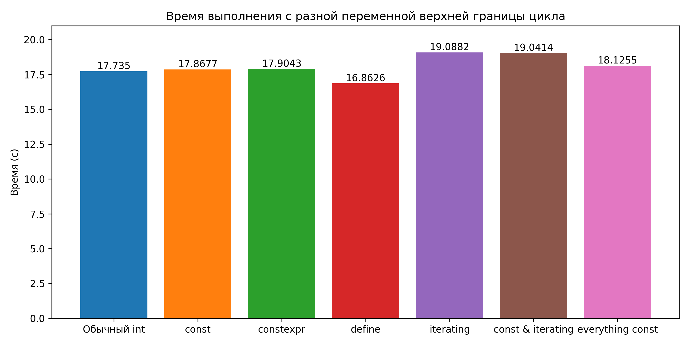
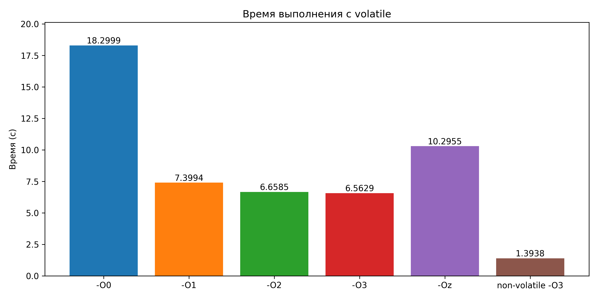
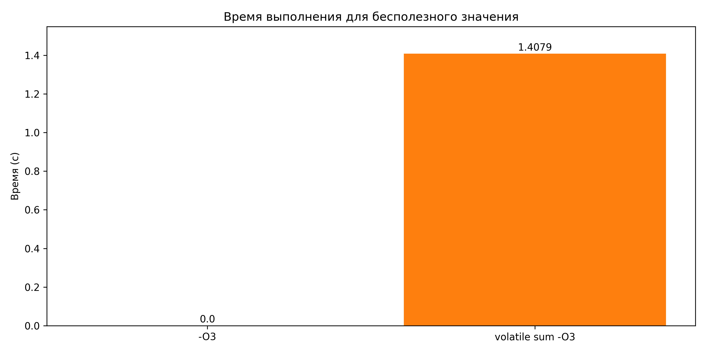

##### Национальный исследовательский ядерный университет «МИФИ» (Московский Инженерно-Физический Институт)

##### Кафедра №42 «Криптология и кибербезопасность»

---

### Лабораторная работа №9: «Контракты с компилятором»

##### Антон Гатченко Б22-525

##### 2025 г.

---

#### Используемая рабочая среда:

- Процессор - AMD Ryzen 5 5600H (laptop), 6c/12t
- Оперативная память – DDR4 16 ГБ
- ОС - Windows 10 Pro 22H2 19045.5854, 64 bit
- IDE – GCC/G++ 13.1

---

#### Практическая часть:

Для таймирования выполнения программы использовалась программа для решения квадратных уравнений, написанная на C++. Её исходный код расположен в [Приложении 1](#Приложение-1). Время выполнения программы усреднялось по 3 пробегам. В случае "`const` все переменные, которые только возможно" (everything const на графике), в const выносился первый коэффициент уравнения.







----

#### Заключение

В ходе выполнения лабораторной работы была исследована роль ключевых слов `const`, `volatile` при оптимизации программного кода на языке C++.

При сравнении времени выполнения для программ с и без `const` наименьшее время показал вариант с `#define` — $16.86$ с, что может быть связано с тем, что препроцессор подставляет значение непосредственно, позволяя компилятору эффективнее оптимизировать цикл. Использование `const`, `constexpr` и обычный `int` дали сопоставимые результаты, $17.7–17.9$ с. Итерирование по вектору показало результат хуже на $7$%, независимо от `const`. Вариант с вынесением большинства значений в `const` показал чуть худший результат, чем обычный `int` и схожие с ним значения.

Далее рассматривалось влияние уровня оптимизации компилятора (`-O0`, `-O1`, `-O2`, `-O3`, `-Oz`) на производительность при использовании `volatile`. Без оптимизаций время выполнения составило $18.30$ с. С увеличением уровня оптимизации наблюдается значительное снижение времени выполнения — до $6.56–6.65$ с при `-O2` и `-O3`. Наилучший результат — всего $1.39$ с, более чем в $5$ раз быстрее чем `-O3` с `volatile` — показал вариант без `volatile` и с `-O3`, что указывает на высокую стоимость `volatile` для производительности.

Для третьего варианта программы, где вычислялась сумма разности корней, которая затем никак не использовалась, `-O3` показывает околонулевое время выполнения, однако при указании `volatile` время становится сопоставимым с обычным вариантом с `-O3`, когда итоговая сумма выводится на экран - $1.4$ секунды.

----

#### Приложение

1. <a id=Приложение-1>Исходный код программы</a>

```c++
#include <iostream>
#include <vector>
#include <array>
#include <random>
#include <chrono>
#include <immintrin.h>
#include <omp.h>

#define SIZE 3e8
#define SEED 1500707

using std::vector, std::array, std::cout, std::endl;

double calculateDiscriminant(double a, double b, double c){
    return b * b - 4 * a * c;
}

double calculateRoot1(double a, double b, double discriminant){
    if (discriminant >= 0){
        return (-b + sqrt(discriminant)) / (2 * a);
    }
    return nan("");
}

double calculateRoot2(double a, double b, double discriminant){
    if (discriminant >= 0){
        return (-b - sqrt(discriminant)) / (2 * a);
    }
    return nan("");
}

vector<array<double, 3>> generateRandomVectorsAVX(const int count, const int seed) {
    cout << "Generating " << count << " random vectors" << endl;
    const auto start = std::chrono::high_resolution_clock::now();

    alignas(32) vector<array<double, 3>> result(count);
    const __m256d scale = _mm256_set1_pd(1e6);

#pragma omp parallel
    {
        const int thread_id = omp_get_thread_num();
        std::mt19937 generator(seed + thread_id);
        std::uniform_real_distribution<double> distribution(-1e6, 1e6);

#pragma omp for
        for (int i = 0; i < count; ++i) {
            __m256d rnd = _mm256_set_pd(
                distribution(generator),
                distribution(generator),
                distribution(generator),
                0.0 // Заполнитель для выравнивания
            );
            rnd = _mm256_mul_pd(rnd, scale);
            _mm256_store_pd(result[i].data(), rnd);
        }
    }

    const auto end = std::chrono::high_resolution_clock::now();
    const std::chrono::duration<double> elapsed = end - start;
	cout << "Finished generating after " << elapsed.count() << " seconds" << endl;

    return result;
}

void timeCode(){
    vector<array<double, 3>> equations = generateRandomVectorsAVX(SIZE, SEED);
	const auto start = std::chrono::high_resolution_clock::now();
    double sum = 0.0;

    // for (const auto &eq: equations){
    for (int i = 0; i < 3e8; i++){
        array<double, 3> eq = equations[i];
        double a = eq[0];
        double b = eq[1];
        double c = eq[2];

        double discriminant = calculateDiscriminant(a, b, c);
        double root1 = calculateRoot1(a, b, discriminant);
        double root2 = calculateRoot2(a, b, discriminant);

        if (!std::isnan(root1) && !std::isnan(root2) && std::isfinite(root1) && std::isfinite(root2)){
            sum += root1 - root2;
        } else{
            sum++;
        }
    }

    const auto end = std::chrono::high_resolution_clock::now();
    const std::chrono::duration<double> elapsed = end - start;
    cout << "Elapsed time: " << elapsed.count() << " seconds;" << " Sum: " << sum << endl;
}

int main(){
    timeCode();
    return 0;
}
```

